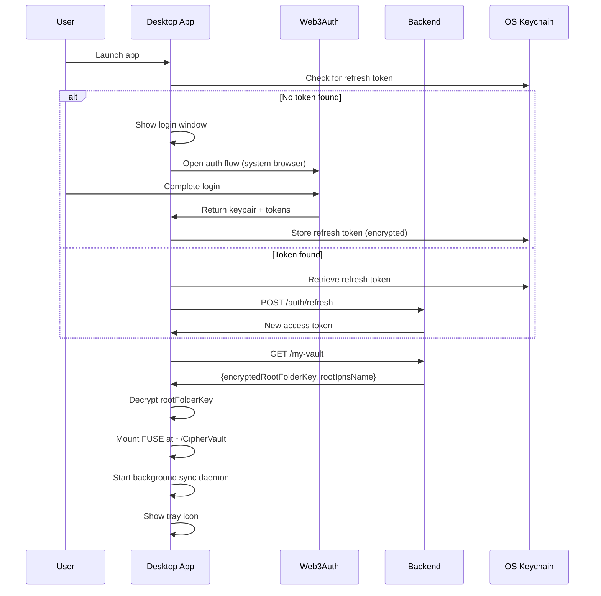

# CipherBox - Client Specification

**Document Type:** Client Application Specification  
**Status:** Active  
**Last Updated:** January 17, 2026  

---

## Table of Contents

1. [Web Application](#1-web-application)
2. [Desktop Application](#2-desktop-application)
3. [Shared Components](#3-shared-components)
4. [Outstanding Questions](#4-outstanding-questions)
5. [Console PoC Harness](#5-console-poc-harness)

---

## Terminology

| Term | Code/API | Prose |
|------|----------|-------|
| Root folder encryption key | `rootFolderKey` | root folder key |
| User's ECDSA public key | `publicKey` | public key |
| User's ECDSA private key | `privateKey` | private key |
| IPNS identifier | `ipnsName` | IPNS name |

---

## 1. Web Application

### 1.1 Tech Stack

| Component | Technology |
|-----------|------------|
| Framework | React 18 + TypeScript |
| Styling | Tailwind CSS |
| State Management | React Context + Hooks |
| Encryption | Web Crypto API |
| IPFS Client | kubo-rpc-client |
| Auth | @web3auth/modal |
| HTTP Client | Axios |

### 1.2 Pages

#### Login Page (`/auth`)

```
┌─────────────────────────────────────────┐
│                                         │
│            🔐 CipherBox                 │
│                                         │
│   Privacy-first encrypted cloud storage │
│                                         │
│      ┌─────────────────────────┐        │
│      │  Continue with Web3Auth │        │
│      └─────────────────────────┘        │
│                                         │
│   By signing in, you agree to our       │
│   Terms of Service and Privacy Policy   │
│                                         │
└─────────────────────────────────────────┘
```

**Behavior:**
1. Click "Continue with Web3Auth"
2. Web3Auth modal opens with auth options
3. User completes authentication
4. Client receives keypair + tokens
5. Redirect to `/vault`

#### Vault Page (`/vault`)

```
┌──────────────────────────────────────────────────────────────┐
│  CipherBox    Root > Documents > Work           [⚙️] [👤]   │
├──────────────┬───────────────────────────────────────────────┤
│              │                                               │
│  📁 Root     │  [+ Folder]  [Upload]          🔍 Search     │
│  ├─📁 Docs   │ ─────────────────────────────────────────────│
│  │ ├─📁 Work │  Name              Size      Modified        │
│  │ └─📁 Pers │ ─────────────────────────────────────────────│
│  └─📁 Archive│  📄 resume.pdf    1.2 MB    Jan 15, 2026     │
│              │  📄 budget.xlsx   256 KB    Jan 14, 2026     │
│              │  📁 Projects      --        Jan 13, 2026     │
│              │                                               │
│              │                                               │
│              │  ┌─────────────────────────────┐              │
│              │  │   Drag files here to upload │              │
│              │  └─────────────────────────────┘              │
│              │                                               │
├──────────────┴───────────────────────────────────────────────┤
│  Storage: 125 MB / 500 MB  │  Last sync: 2 min ago  │ [🔄]  │
└──────────────────────────────────────────────────────────────┘
```

**Components:**
- **Sidebar:** Folder tree with expand/collapse
- **Breadcrumb:** Current path navigation
- **File List:** Sortable table (name, size, modified)
- **Drag-Drop Zone:** Upload indicator
- **Storage Bar:** Quota usage
- **Sync Status:** Last sync time + manual refresh

**Actions:**
- Click folder → Navigate into
- Double-click file → Download
- Right-click → Context menu (rename, delete, move)
- Drag file → Upload
- Multi-select → Bulk operations

#### Settings Page (`/settings`)

**Sections:**

1. **Linked Accounts**
   - List linked auth methods from Web3Auth
   - "Link Another Account" button → Web3Auth linking flow

2. **Security**
   - Display public key (truncated with copy button)
   - Display user ID

3. **Data & Privacy**
   - "Export Vault" button → Download JSON
   - Storage usage details

4. **Session**
   - Current auth method indicator
   - "Logout" button

5. **Danger Zone**
   - "Delete Account" button with confirmation

### 1.3 Components

#### FileList

```typescript
interface FileListProps {
  items: (FileEntry | FolderEntry)[];
  onNavigate: (folderId: string) => void;
  onDownload: (fileId: string) => void;
  onRename: (id: string, newName: string) => void;
  onDelete: (ids: string[]) => void;
  onMove: (ids: string[], destinationId: string) => void;
}
```

#### FolderTree

```typescript
interface FolderTreeProps {
  root: FolderNode;
  currentPath: string[];
  onNavigate: (path: string[]) => void;
  onCreateFolder: (parentPath: string[], name: string) => void;
}
```

#### UploadZone

```typescript
interface UploadZoneProps {
  currentFolderId: string;
  onUpload: (files: File[]) => void;
  onProgress: (fileId: string, progress: number) => void;
}
```

### 1.4 State Management

```typescript
interface AppState {
  // Auth
  isAuthenticated: boolean;
  privateKey: Uint8Array | null;  // RAM only, never persisted
  publicKey: string | null;
  accessToken: string | null;
  
  // Vault
  rootFolderKey: Uint8Array | null;
  rootIpnsName: string | null;
  
  // UI
  currentPath: string[];
  fileTree: FolderNode | null;
  selectedItems: string[];
  
  // Sync
  lastSyncTime: Date | null;
  isSyncing: boolean;
}
```

**Critical:** `privateKey` and `rootFolderKey` must never be:
- Written to localStorage/sessionStorage
- Logged to console
- Sent to analytics

### 1.5 Acceptance Criteria

| ID | Criterion | Test Method |
|----|-----------|-------------|
| W1 | Vault page loads within 2s (cached) | Performance test |
| W2 | First load within 5s (fresh fetch) | Performance test |
| W3 | Drag-drop upload works for files <100MB | Manual test |
| W4 | Decrypted file names display correctly | Integration test |
| W5 | Logout clears all sensitive data | Memory inspection |
| W6 | Export generates valid JSON | Unit test |
| W7 | Responsive on mobile/tablet/desktop | Visual test |

---

## 2. Desktop Application

### 2.1 Tech Stack

| Component | Technology |
|-----------|------------|
| Framework | Tauri (preferred) or Electron |
| FUSE (macOS) | macFUSE via fuse-t |
| FUSE (Linux) | FUSE3 |
| FUSE (Windows) | WinFSP |
| Keychain (macOS) | Security framework |
| Keychain (Linux) | Secret Service API |
| Keychain (Windows) | Credential Manager |

### 2.2 Architecture

```
┌─────────────────────────────────────────┐
│           Desktop Application            │
├─────────────────────────────────────────┤
│  ┌─────────────┐  ┌──────────────────┐  │
│  │  Tray Icon  │  │   Login Window   │  │
│  └─────────────┘  └──────────────────┘  │
├─────────────────────────────────────────┤
│  ┌─────────────────────────────────────┐│
│  │         FUSE Mount Manager          ││
│  │  ~/CipherVault ←→ IPFS Network     ││
│  └─────────────────────────────────────┘│
├─────────────────────────────────────────┤
│  ┌─────────────────────────────────────┐│
│  │       Background Sync Daemon        ││
│  │    Poll IPNS every 30 seconds       ││
│  └─────────────────────────────────────┘│
├─────────────────────────────────────────┤
│  ┌─────────────────────────────────────┐│
│  │          Crypto Module              ││
│  │   AES-GCM, ECIES, Key Management   ││
│  └─────────────────────────────────────┘│
└─────────────────────────────────────────┘
```

### 2.3 FUSE Mount

**Mount Point:** `~/CipherVault/` (user-configurable)

**Operations:**

| Operation | Implementation |
|-----------|----------------|
| `readdir` | Decrypt folder metadata, return child names |
| `getattr` | Return file attributes from metadata |
| `open` | Fetch from IPFS, decrypt, return handle |
| `read` | Return decrypted content from cache |
| `write` | Encrypt, upload, update IPNS |
| `create` | Generate keys, encrypt, upload, update IPNS |
| `unlink` | Unpin CID, update parent IPNS |
| `mkdir` | Generate folder keys, create IPNS, update parent |
| `rmdir` | Unpin folder IPNS, update parent |
| `rename` | Update metadata in source and destination |

**Caching:**
- File metadata cached in memory (TTL: 1 hour)
- File content cached on disk (encrypted, TTL: configurable)
- IPNS resolution cached (TTL: 30 seconds)

### 2.4 Authentication Flow



### 2.5 Background Sync

```typescript
class SyncDaemon {
  private pollInterval = 30000; // 30 seconds
  private cachedRootCid: string | null = null;
  
  async start() {
    setInterval(() => this.poll(), this.pollInterval);
  }
  
  async poll() {
    try {
      // Resolve root IPNS
      const currentCid = await ipfs.name.resolve(rootIpnsName);
      
      if (currentCid !== this.cachedRootCid) {
        // Changes detected
        this.cachedRootCid = currentCid;
        await this.refreshMetadataTree();
        this.notifyUser("Vault updated");
      }
    } catch (error) {
      // Network error - use exponential backoff
      this.handleError(error);
    }
  }
}
```

### 2.6 Tray Menu

```
┌─────────────────────────┐
│ ✓ CipherBox             │
├─────────────────────────┤
│   Status: Synced        │
│   Last sync: 2 min ago  │
├─────────────────────────┤
│   Open CipherVault      │
│   Sync Now              │
├─────────────────────────┤
│   Preferences...        │
│   About CipherBox       │
├─────────────────────────┤
│   Logout                │
│   Quit                  │
└─────────────────────────┘
```

### 2.7 Acceptance Criteria

| ID | Criterion | Test Method |
|----|-----------|-------------|
| D1 | FUSE mount succeeds in <3s | Performance test |
| D2 | File read latency <500ms (cached) | Benchmark |
| D3 | File read latency <2s (uncached) | Benchmark |
| D4 | File write triggers IPNS publish in <5s | Integration test |
| D5 | Multi-platform builds work | CI/CD test |
| D6 | No plaintext on disk (except temp decrypted reads) | Security audit |
| D7 | Logout unmounts FUSE and clears keys | Manual test |

---

## 3. Shared Components

### 3.1 Crypto Module

Both web and desktop apps share encryption logic:

```typescript
interface CryptoModule {
  // AES-256-GCM
  encryptFile(plaintext: Uint8Array, key: Uint8Array): Promise<{
    ciphertext: Uint8Array;
    iv: Uint8Array;
    tag: Uint8Array;
  }>;
  
  decryptFile(ciphertext: Uint8Array, key: Uint8Array, iv: Uint8Array): Promise<Uint8Array>;
  
  // ECIES
  encryptKey(key: Uint8Array, publicKey: Uint8Array): Promise<Uint8Array>;
  decryptKey(encryptedKey: Uint8Array, privateKey: Uint8Array): Promise<Uint8Array>;
  
  // Key generation
  generateFileKey(): Uint8Array;
  generateIv(): Uint8Array;
  generateIpnsKeypair(): { publicKey: Uint8Array; privateKey: Uint8Array };
}
```

### 3.2 IPFS Module

```typescript
interface IpfsModule {
  // Content operations
  add(content: Uint8Array): Promise<string>; // Returns CID
  get(cid: string): Promise<Uint8Array>;
  
  // IPNS operations
  resolveIpns(name: string): Promise<string>; // Returns CID
  publishIpns(cid: string, privateKey: Uint8Array): Promise<void>;
}
```

### 3.3 Vault Module

```typescript
interface VaultModule {
  // Tree operations
  fetchFolderTree(ipnsName: string, folderKey: Uint8Array): Promise<FolderNode>;
  
  // File operations
  uploadFile(file: File, parentFolder: FolderNode): Promise<FileEntry>;
  downloadFile(fileEntry: FileEntry): Promise<Uint8Array>;
  
  // Folder operations
  createFolder(name: string, parentFolder: FolderNode): Promise<FolderEntry>;
  
  // IPNS publishing
  publishFolderUpdate(folder: FolderNode): Promise<void>;
}
```

---

## 4. Outstanding Questions

### 4.1 Error Handling

| Question | Context | Priority |
|----------|---------|----------|
| What does user see when IPFS gateway is unavailable? | Network errors | High |
| How to handle IPNS publish failures? | Write operations | High |
| What timeout thresholds for file operations? | Performance UX | Medium |
| Should failed uploads be queued for retry? | Reliability | Medium |
| How to display partial sync failures? | Multi-file operations | Low |

### 4.2 Offline Behavior

| Question | Context | Priority |
|----------|---------|----------|
| Show cached data or error state when offline? | Web app | High |
| Queue writes for later sync? | Desktop app | Medium |
| How long to retain offline cache? | Desktop app | Low |
| Indicate stale data age to user? | Both | Medium |

### 4.3 Browser Support

| Question | Context | Priority |
|----------|---------|----------|
| Minimum browser versions for Web Crypto API? | Compatibility | High |
| Safari WebCrypto quirks to handle? | Cross-browser | High |
| Mobile browser support (iOS Safari, Chrome Android)? | Mobile web | Medium |
| Graceful degradation for unsupported browsers? | Edge cases | Low |

### 4.4 Accessibility

| Question | Context | Priority |
|----------|---------|----------|
| WCAG compliance target level? | Accessibility | Medium |
| Screen reader support requirements? | Accessibility | Medium |
| Keyboard navigation for all operations? | Accessibility | High |
| High contrast mode support? | Visual accessibility | Low |

### 4.5 Internationalization

| Question | Context | Priority |
|----------|---------|----------|
| English-only for v1? | Scope | Confirmed: Yes |
| RTL layout support needed? | i18n | Deferred |
| Date/time format localization? | UX | Low |

### 4.6 Desktop Specific

| Question | Context | Priority |
|----------|---------|----------|
| Auto-start on login option? | UX | Low |
| Menu bar icon vs dock icon? | macOS UX | Medium |
| System notification permissions? | Desktop UX | Medium |
| Auto-update mechanism? | Distribution | High |

---

## 5. Console PoC Harness

**Goal:** Provide a single-user, online test harness to validate IPFS/IPNS flows without Web3Auth or the backend.

**Environment:** Node.js (TypeScript), local IPFS daemon, optional Pinata API keys for pin/unpin.

**Behavior:**

1. Load `privateKey` from `.env` (never logged)
2. Generate `rootFolderKey` and root IPNS key
3. Create folders and publish IPNS updates
4. Upload, modify, rename, move, delete a file
5. Verify each step by resolving IPNS and decrypting metadata/content
6. Measure IPNS propagation delay per publish
7. Teardown: unpin all created CIDs (files + folder metadata) and remove IPNS keys

**Persistence:**
- `rootFolderKey` and `rootIpnsName` are persisted to disk during the run
- Private keys remain in memory only

**Non-goals:**
- Web UI or desktop UI
- Web3Auth integration
- Vault export or recovery workflows

---

## Related Documents

- [PRD.md](./PRD.md) - Product requirements and user journeys
- [TECHNICAL_ARCHITECTURE.md](./TECHNICAL_ARCHITECTURE.md) - System design and encryption
- [API_SPECIFICATION.md](./API_SPECIFICATION.md) - Backend endpoints
- [DATA_FLOWS.md](./DATA_FLOWS.md) - Sequence diagrams

---

**End of Client Specification**
