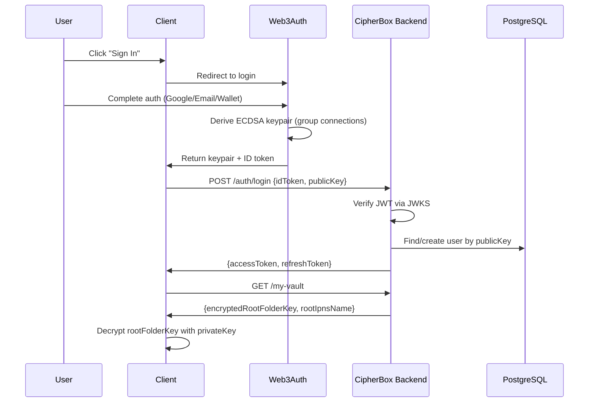
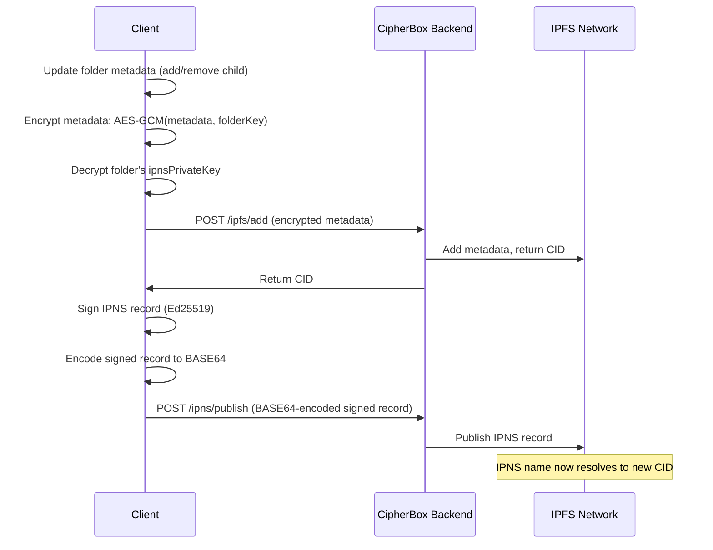
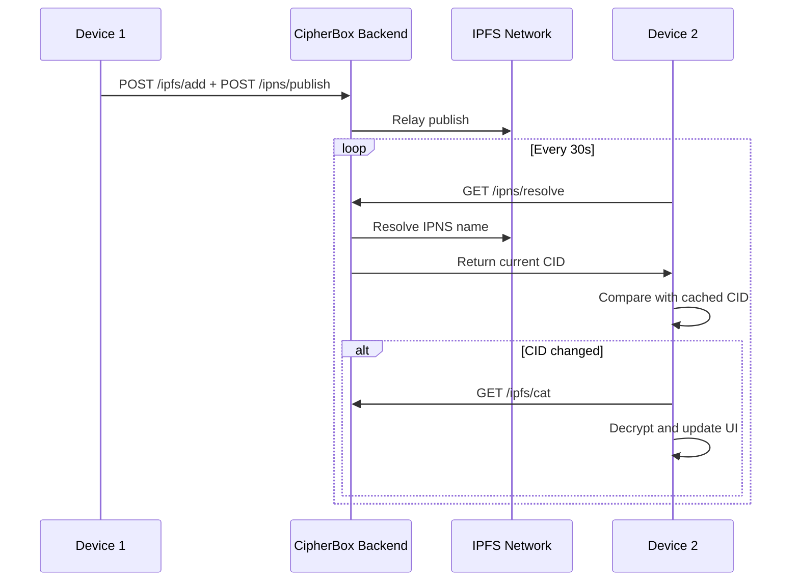
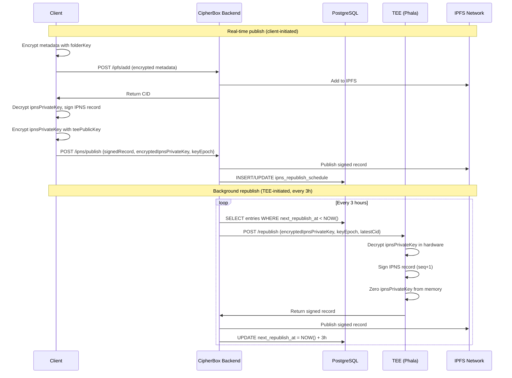

# CipherBox - Technical Architecture

**Document Type:** Technical Specification
**Status:** Active
**Last Updated:** January 20, 2026  

---

## Table of Contents

1. [System Overview](#1-system-overview)
2. [Authentication Architecture](#2-authentication-architecture)
3. [Encryption Architecture](#3-encryption-architecture)
4. [Key Management](#4-key-management)
5. [IPFS & IPNS Architecture](#5-ipfs--ipns-architecture)
6. [Tech Stack](#6-tech-stack)
7. [Threat Model](#7-threat-model)
8. [Acceptance Criteria](#8-acceptance-criteria)
9. [TEE-Based IPNS Republishing Architecture](#9-tee-based-ipns-republishing-architecture)

---

## Terminology

| Term | Code/API | Prose | Notes |
|------|----------|-------|-------|
| Root folder encryption key | `rootFolderKey` | root folder key | AES-256 symmetric key |
| User's ECDSA public key | `publicKey` | public key | secp256k1 curve |
| User's ECDSA private key | `privateKey` | private key | Never stored/transmitted |
| IPNS identifier | `ipnsName` | IPNS name | e.g., k51qzi5uqu5dlvj55... |
| IPNS signed data structure | `ipnsRecord` | IPNS record | Contains encrypted metadata |
| Folder encryption key | `folderKey` | folder key | Per-folder AES-256 key |
| File encryption key | `fileKey` | file key | Per-file AES-256 key |
| IPNS signing key | `ipnsPrivateKey` | IPNS private key | Ed25519, stored encrypted |
| TEE public key | `teePublicKey` | TEE public key | Current epoch key for IPNS key encryption |
| TEE epoch | `teeEpoch` | TEE epoch | Key rotation epoch identifier |
| Encrypted IPNS key (for TEE) | `encryptedIpnsPrivateKey` | encrypted IPNS private key | IPNS key encrypted with TEE public key |

---

## 1. System Overview

### 1.1 Architecture Diagram

```
┌─────────────────────────────────────────────────────────────┐
│                    End User Devices                         │
├─────────────────────────────────────────────────────────────┤
│  ┌──────────────────┐  ┌──────────────────┐                 │
│  │   Web Browser    │  │  Desktop App     │                 │
│  │   (React 18)     │  │  (Tauri/Electron)│                 │
│  │  FUSE: No        │  │  FUSE: Yes       │                 │
│  └────────┬─────────┘  └────────┬─────────┘                 │
│           └──────────┬──────────┘                           │
└──────────────────────┼──────────────────────────────────────┘
                       │
          ┌────────────┴────────────┐
          │                         │
          ▼                         ▼
   ┌──────────────┐          ┌─────────────────┐
   │  Web3Auth    │          │  CipherBox      │
   │  Network     │          │  Backend        │
   │              │          │  (NestJS)       │
   │ • Auth UI    │          │                 │
   │ • OAuth      │          │ • JWT/SIWE auth │
   │ • Key derive │          │ • Token mgmt    │
   │ • Group conn │          │ • File upload   │
   │              │          │ • Vault mgmt    │
   └──────────────┘          └────────┬────────┘
                                      │
                ┌─────────────────────┼─────────────────────┐
                │                     │                     │
                ▼                     ▼                     ▼
         ┌────────────┐        ┌──────────┐          ┌─────────┐
         │ PostgreSQL │        │ Pinata   │          │ IPFS    │
         │            │        │ (Pinning)│          │ Network │
         │ • Users    │        │          │          │         │
         │ • Vaults   │        │ Pins     │          │ P2P     │
         │ • Tokens   │        │ encrypted│          │ Storage │
         │ • Audit    │        │ data     │          │         │
         │ • TEE keys │        └──────────┘          └─────────┘
         │ • Republish│               ▲
         │   schedule │               │
         └────────────┘               │
                │                     │
                ▼                     │
         ┌─────────────────┐          │
         │  TEE Provider   │──────────┘
         │  (Phala Cloud)  │   IPNS Republish
         │                 │
         │ • Hardware TEE  │
         │ • Key decrypt   │
         │ • IPNS signing  │
         │ • Key discard   │
         │                 │
         │ Fallback:       │
         │ AWS Nitro       │
         └─────────────────┘
```

### 1.2 Core Principles

1. **Zero-Knowledge Server:** Backend never holds plaintext files or unencrypted keys
2. **Client-Side Encryption:** All encryption/decryption happens in browser or desktop app
3. **Deterministic Keys:** Same user + any linked auth method → same ECDSA keypair
4. **Decentralized Storage:** Files stored on IPFS, metadata in IPNS records
5. **User-Held Keys:** Private key exists only in client RAM during session
6. **Signed-Record Relay:** Clients sign IPNS records; backend relays to IPFS/IPNS

---

## 2. Authentication Architecture

### 2.1 Two-Phase Authentication

CipherBox uses a two-phase authentication approach:

1. **Phase 1 (Web3Auth):** User authenticates to derive ECDSA keypair
2. **Phase 2 (CipherBox Backend):** User authenticates to obtain access/refresh tokens



### 2.2 Supported Auth Methods (via Web3Auth)

| Method | Flow | Notes |
|--------|------|-------|
| Email + Password | Web3Auth verifies credentials | Password never sent to CipherBox |
| OAuth (Google/Apple/GitHub) | Standard OAuth via Web3Auth | Token verified by Web3Auth |
| Magic Link | Email link via Web3Auth | Passwordless |
| External Wallet | MetaMask/WalletConnect signature | Trustless, wallet proves identity |

### 2.3 Web3Auth Group Connections

All auth methods in the same group derive identical ECDSA keypairs:

```typescript
const modalConfig = {
  connectors: {
    [WALLET_CONNECTORS.AUTH]: {
      loginMethods: {
        google: {
          authConnectionId: 'w3a-google',
          groupedAuthConnectionId: 'cipherbox-aggregate',  // Group ID
        },
        email_passwordless: {
          authConnectionId: 'w3a-email-passwordless',
          groupedAuthConnectionId: 'cipherbox-aggregate',  // Same group
        },
      },
    },
  },
};
```

**Key Property:** `same user + any grouped auth method → same keypair → same vault`

### 2.4 CipherBox Backend Authentication Options

After Web3Auth key derivation, client authenticates with backend:

**Option A: Web3Auth ID Token (JWT)**
- Client sends ID token to backend
- Backend verifies via Web3Auth JWKS endpoint
- Simpler flow, relies on Web3Auth token signing

**Option B: SIWE-like Signature**
- Client requests nonce from backend
- Client signs message with private key
- Backend verifies signature recovers to claimed public key
- More control, doesn't rely on Web3Auth tokens

### 2.5 Token Architecture

| Token | Issuer | Expiry | Storage | Purpose |
|-------|--------|--------|---------|---------|
| Web3Auth ID Token | Web3Auth | 1 hour | Memory | Authenticate with CipherBox backend |
| Access Token | CipherBox | 15 min | Memory only | API authorization |
| Refresh Token | CipherBox | 7 days | HTTP-only cookie or encrypted storage | Obtain new access tokens |

### 2.6 Web3Auth Key Export (Recovery Path)

Users can export their Web3Auth private key for disaster recovery:

```
Normal flow: User → Web3Auth → keypair → vault access

Recovery flow (Web3Auth unavailable):
1. User has previously exported Web3Auth private key
2. User imports key directly into CipherBox recovery tool
3. Tool derives publicKey from privateKey
4. Tool decrypts vault export using privateKey
5. User has full vault access without Web3Auth

Note: Direct key import bypasses Web3Auth entirely.
Future implementation can support this as fallback.
```

---

## 3. Encryption Architecture

### 3.1 Encryption Primitives

| Algorithm | Purpose | Standard | Implementation | Version |
|-----------|---------|----------|----------------|---------|
| AES-256-GCM | File content + metadata encryption | NIST | Web Crypto API | v1.0+ |
| AES-256-CTR | Streaming file encryption (video/audio) | NIST | Web Crypto API | v1.1+ |
| ECIES (secp256k1) | Key wrapping (asymmetric encryption of symmetric keys) | SEC 2 | ethers.js | v1.0+ |
| ECDSA (secp256k1) | Signing, key derivation | NIST/SECG | Web3Auth | v1.0+ |
| Ed25519 | IPNS record signing | RFC 8032 | libsodium.js | v1.0+ |
| HKDF-SHA256 | Key derivation | RFC 5869 | Web Crypto API | v1.0+ |
| SHA-256 | Hashing | NIST | Web Crypto API | v1.0+ |

### 3.1.1 Encryption Mode Roadmap

CipherBox implements a hybrid encryption approach to balance security with streaming capabilities:

**v1.0 (Current): Foundation**
- All files encrypted with AES-256-GCM
- `encryptionMode` metadata field added to all files (set to "GCM")
- Provides authenticated encryption with 16-byte authentication tag
- No streaming support (full file must be downloaded before decryption)

**v1.1 (Future): Hybrid GCM + CTR**
- Implement AES-256-CTR encryption for streaming use cases
- Auto-detect MIME type (video/audio → CTR, others → GCM)
- Support chunk-by-chunk decryption for media streaming
- Maintain security via IPNS signatures + IPFS CID hashing

**Security Basis for CTR Mode:**

While AES-256-CTR lacks per-file authentication tags, CipherBox mitigates this through:

1. **IPNS Signature (Ed25519):** Every folder metadata update is signed with Ed25519, preventing CID substitution attacks
2. **IPFS CID Hash:** Content-addressed storage ensures any modification to encrypted content produces a different CID
3. **Metadata-Level Authentication:** The combination of IPNS signatures + CID hashing provides cryptographic integrity protection through metadata-level authentication

This layered approach allows CTR streaming while maintaining zero-knowledge security guarantees.

### 3.2 File Encryption (v1.0)

Each file is encrypted with a unique random key:

```
1. Generate random fileKey (256-bit AES key)
2. Generate random IV (96-bit for GCM)
3. Encrypt file content:
   ciphertext = AES-256-GCM(plaintext, fileKey, IV)
   Output: ciphertext + 16-byte authentication tag

4. Wrap fileKey with user's public key:
   encryptedFileKey = ECIES(fileKey, publicKey)
   Output: ephemeral_pubkey || nonce || ciphertext || auth_tag

5. Store in folder metadata:
   - cid: IPFS content identifier
   - fileKeyEncrypted: wrapped key
   - fileIv: IV for decryption
   - encryptionMode: "GCM" (for all files in v1.0)
```

**v1.1 Roadmap Note:** Future versions will support AES-256-CTR for streaming video/audio files. The `encryptionMode` field enables this without requiring data migration. See Section 3.1.1 for security details.

### 3.3 Folder Metadata Encryption

Folder metadata (child list) is encrypted with the folder's key:

```
1. Serialize metadata to JSON
2. Generate random IV (96-bit)
3. Encrypt:
   encryptedMetadata = AES-256-GCM(metadataJson, folderKey, IV)

4. Store in IPNS record:
   {
     "version": "1.0",
     "encryptedMetadata": "0x...",
     "iv": "0x...",
     "signature": "..." // IPNS signature
   }
```

### 3.4 Decrypted Metadata Structure

```json
{
  "children": [
    {
      "type": "folder",
      "nameEncrypted": "0x...",
      "nameIv": "0x...",
      "ipnsName": "k51qzi5uqu5dlvj66...",
      "ipnsPrivateKeyEncrypted": "0x...",
      "folderKeyEncrypted": "0x...",
      "created": 1705268100,
      "modified": 1705268100
    },
    {
      "type": "file",
      "nameEncrypted": "0x...",
      "nameIv": "0x...",
      "cid": "QmXxxx...",
      "fileKeyEncrypted": "0x...",
      "fileIv": "0x...",
      "encryptionMode": "GCM",
      "size": 2048576,
      "created": 1705268100,
      "modified": 1705268100
    }
  ],
  "metadata": {
    "created": 1705268100,
    "modified": 1705268100
  }
}
```

**Field Descriptions:**
- `encryptionMode`: Specifies the encryption algorithm used for file content ("GCM" or "CTR"). Always "GCM" in v1.0. Added to support future streaming capabilities (v1.1+). Client-side decryption logic must default to "GCM" if field is missing for backward compatibility.

### 3.5 No File Deduplication

CipherBox does NOT deduplicate files. Each upload uses:
- Unique random 256-bit AES key
- Unique random 96-bit IV

Same file uploaded twice produces different ciphertexts and different CIDs. This is a security feature—deduplication would leak information about file contents.

**Note:** This no-deduplication policy applies to all encryption modes (both GCM and future CTR). Each file receives unique encryption parameters regardless of the algorithm used.

---

## 4. Key Management

### 4.1 Key Hierarchy

```
User Authentication (Web3Auth)
    │
    ▼
ECDSA Keypair (secp256k1)
    │
    ├─► privateKey
    │   • Client RAM only
    │   • Never transmitted
    │   • Never persisted
    │   • Used for: ECIES decrypt, SIWE sign
    │   • Destroyed on logout
    │
    └─► publicKey
        • Stored on CipherBox server
        • Used to identify user
        • Used to encrypt all data keys

Root Folder Key (AES-256)
    │
    ├─► Generated on vault init
    ├─► Stored encrypted on server: ECIES(rootFolderKey, publicKey)
    └─► Decrypted client-side on login

Root IPNS Private Key (Ed25519)
    │
    ├─► Generated on vault init
    ├─► Stored encrypted on server: ECIES(ipnsPrivateKey, publicKey)
    └─► Decrypted client-side for IPNS publishing

Subfolder Keys (AES-256, one per folder)
    │
    ├─► Generated on folder creation
    ├─► Stored encrypted in parent metadata
    └─► Decrypted when traversing tree

File Keys (AES-256, one per file)
    │
    ├─► Generated on file upload
    ├─► Stored encrypted in folder metadata
    └─► Decrypted when downloading
```

### 4.2 Key Storage Summary

| Key | Storage Location | Encrypted With | When Decrypted |
|-----|------------------|----------------|----------------|
| privateKey | Client RAM only | N/A | Session lifetime |
| publicKey | Server (Users table) | N/A (public) | N/A |
| rootFolderKey | Server (Vaults table) | ECIES(publicKey) | On login |
| rootIpnsPrivateKey | Server (Vaults table) | ECIES(publicKey) | On login |
| folderKey | Parent IPNS record | ECIES(publicKey) | On folder access |
| fileKey | Folder IPNS record | ECIES(publicKey) | On file download |
| ipnsPrivateKey (subfolder) | Parent IPNS record | ECIES(publicKey) | On folder write |
| teePublicKey (current) | Server (tee_key_state) | N/A (public) | Returned at login |
| teePublicKey (previous) | Server (tee_key_state) | N/A (public) | Returned at login (grace period) |
| encryptedIpnsPrivateKey (for TEE) | Server (ipns_republish_schedule) | ECIES(teePublicKey) | By TEE during republish |

### 4.3 TEE Key Epochs

TEE public keys are organized by epochs for key rotation:

```
TEE Key State (in PostgreSQL):
├─► currentEpoch: 5
├─► currentPublicKey: 0x04abc123...  (secp256k1)
├─► previousEpoch: 4
└─► previousPublicKey: 0x04def456... (4-week grace period)

Client Flow:
1. Login response includes teeKeys: { currentEpoch, currentPublicKey, previousEpoch, previousPublicKey }
2. Client encrypts ipnsPrivateKey with currentPublicKey: ECIES(ipnsPrivateKey, teePublicKey)
3. Client sends encryptedIpnsPrivateKey + keyEpoch with IPNS publish requests
4. Backend stores in ipns_republish_schedule for TEE republishing
```

**Key Rotation (4-Week Grace Period):**
- Week 0: Rotation announced (TEE governance)
- Week 4: Backend detects new epoch, updates tee_key_state
- Week 5: TEE republishes auto-upgrade old entries to new epoch
- Week 6: Clients get new keys on login
- Week 8: Old epoch deprecated

### 4.4 Key Lifecycle

**Session Start:**
1. User authenticates via Web3Auth
2. privateKey reconstructed in client RAM
3. Client fetches encrypted rootFolderKey from server
4. Client decrypts rootFolderKey with privateKey
5. Session active

**Session End:**
1. User clicks logout (or session expires)
2. Clear privateKey from memory
3. Clear rootFolderKey from memory
4. Clear all cached folder keys
5. Clear all tokens

### 4.5 PoC Local Key Bootstrap (Console Harness)

The console PoC bypasses Web3Auth and the backend. It uses a locally provided `privateKey` and persists only the minimum vault state to disk for the duration of the run.

**PoC bootstrap rules:**
- Load `privateKey` from `.env` (client-only, never logged)
- Derive `publicKey` locally (secp256k1)
- Generate `rootFolderKey` and store on disk for the run
- Generate per-folder IPNS keys on the local IPFS node
- Store the IPNS key **name** encrypted with ECIES in folder metadata (stand-in for `ipnsPrivateKey`), while the actual IPNS private key remains in the local IPFS keystore

**Teardown:**
- Unpin all file and folder metadata CIDs created during the run
- Remove any IPNS keys created in the local IPFS keystore

---

## 5. IPFS & IPNS Architecture

### 5.1 Per-Folder IPNS Records

Each folder has its own IPNS record with dedicated keypair:

```
Root Folder
├─► IPNS Name: k51qzi5uqu5dlvj55...
├─► IPNS Private Key: stored encrypted on server
└─► Contains: encrypted list of children

Subfolder (Documents)
├─► IPNS Name: k51qzi5uqu5dlvj66...
├─► IPNS Private Key: stored encrypted in parent metadata
└─► Contains: encrypted list of children
```

This design enables future per-folder sharing (v2+).

### 5.2 IPNS Publishing Flow



**Key Point:** Client signs IPNS records locally; backend relays signed records only. Private keys never leave client.

### 5.3 Tree Traversal

```typescript
async function fetchFileTree(ipnsName: string, folderKey: Uint8Array): Promise<FolderNode> {
  // 1. Resolve IPNS via backend relay
  const { cid } = await api.get(`/ipns/resolve?ipnsName=${ipnsName}`);
  
  // 2. Fetch encrypted metadata from IPFS
  const encryptedData = await api.get(`/ipfs/cat?cid=${cid}`, { responseType: "arraybuffer" });
  const { encryptedMetadata, iv } = JSON.parse(encryptedData);
  
  // 3. Decrypt metadata
  const metadataJson = AES256GCM_Decrypt(encryptedMetadata, folderKey, iv);
  const metadata = JSON.parse(metadataJson);
  
  // 4. Process children
  const tree = { children: [] };
  for (const child of metadata.children) {
    if (child.type === "folder") {
      // Decrypt subfolder key
      const subfolderKey = ECIES_Decrypt(child.folderKeyEncrypted, privateKey);
      // Recursively fetch subfolder
      const childTree = await fetchFileTree(child.ipnsName, subfolderKey);
      tree.children.push({ type: "folder", name: decrypt(child.nameEncrypted), subtree: childTree });
    } else {
      tree.children.push({ type: "file", name: decrypt(child.nameEncrypted), cid: child.cid });
    }
  }
  return tree;
}
```

### 5.4 Sync via IPNS Polling



### 5.5 Conflict Resolution (v1)

For v1, IPFS network determines which IPNS update wins:
- IPNS records have sequence numbers
- Latest valid record (highest sequence) wins
- No application-level conflict resolution

Future versions may implement vector clocks or CRDTs.

---

## 6. Tech Stack

| Component | Technology | Rationale |
|-----------|------------|-----------|
| Frontend | React 18 + TypeScript | Modern, good for encryption UI |
| Web Crypto | Web Crypto API | Native browser encryption |
| IPFS Client | CipherBox IPFS relay | HTTP relay to IPFS/IPNS |
| Web3Auth SDK | @web3auth/modal | Auth and key derivation |
| Backend | Node.js + NestJS + TypeScript | Type-safe, same language as frontend |
| JWT Verification | jose | Verify Web3Auth tokens |
| Database | PostgreSQL | ACID, structured data |
| IPFS Pinning | Pinata API | Managed pinning service |
| Desktop (macOS) | Tauri or Electron | FUSE support |
| FUSE (macOS) | macFUSE | Userland filesystem |

---

## 7. Threat Model

### 7.1 Server Compromise

**Scenario:** Attacker gains access to CipherBox database and code.

**What attacker has:**
- Encrypted root folder keys
- User public keys
- Refresh token hashes
- IPNS names

**What attacker cannot do:**
- Decrypt any files (no private keys)
- Impersonate users (refresh tokens are hashed)
- Access vault contents (all encrypted)

**Mitigation:** Private keys never stored on server. Zero-knowledge architecture.

### 7.2 Web3Auth Compromise

**Scenario:** Attacker compromises Web3Auth infrastructure.

**Impact:** Could potentially derive user keypairs (requires compromising threshold of nodes).

**Mitigation:**
- Web3Auth uses threshold cryptography (no single point of failure)
- Users can export keys for independent recovery
- SIWE auth validates identity without relying on Web3Auth tokens

### 7.3 Network Interception

**Scenario:** Attacker intercepts HTTPS traffic.

**What attacker sees:**
- Ciphertexts (encrypted files)
- IPFS CIDs
- Public keys

**What attacker cannot do:**
- Decrypt ciphertexts (no private keys)
- Derive private key from public key

**Mitigation:** HTTPS enforced, all sensitive data encrypted.

### 7.4 Client Compromise

**Scenario:** Attacker gains control of user's device during active session.

**Impact:** Attacker can access private key in RAM.

**Mitigation:**
- Keys discarded on logout
- Short access token expiry (15 min)
- External wallet auth requires wallet approval

### 7.5 Refresh Token Theft

**Scenario:** Attacker steals refresh token.

**Impact:** Attacker can obtain new access tokens, impersonate user.

**Mitigation:**
- Refresh token rotation (new token on each use)
- Secure storage (HTTP-only cookie)
- Short access token expiry limits exposure

### 7.6 TEE Compromise

**Scenario:** Attacker compromises TEE hardware or TEE provider infrastructure.

**What attacker could access:**
- IPNS private keys during the brief decryption window (milliseconds)
- Ability to sign IPNS records for affected users

**What attacker cannot do:**
- Decrypt file contents (IPNS keys only sign metadata pointers, not file encryption keys)
- Access vault encryption keys (stored encrypted with user's publicKey, not TEE)
- Persist IPNS private keys (TEE zeroes memory after signing)
- Affect users who haven't published since last TEE key rotation

**Impact severity:** Medium
- Attacker could point IPNS names to malicious CIDs
- Users would see corrupted/fake metadata (detectable by decryption failure)
- Cannot access actual file contents

**Mitigation:**
- TEE hardware attestation (Intel SGX/AMD SEV) verified before key operations
- IPNS private keys decrypted only for milliseconds, then zeroed
- 4-week key epoch rotation limits exposure window
- Multi-epoch fallback allows rapid migration to new TEE keys
- Primary provider (Phala Cloud) with fallback (AWS Nitro) for provider diversification
- Monitoring: republish success rate, epoch lag, unusual patterns

---

## 8. Acceptance Criteria

### 8.1 Security Criteria

| ID | Criterion | Test Method | Owner |
|----|-----------|-------------|-------|
| S1 | Private key never written to localStorage/sessionStorage | Unit test: mock storage, verify no writes | Frontend |
| S2 | Private key cleared from memory on logout | Integration test: verify state cleared | Frontend |
| S3 | All /vault/upload requests contain only encrypted content | Network inspection test | QA |
| S4 | ECIES decryption fails with wrong private key | Unit test: decrypt with random key | Frontend |
| S5 | AES-GCM decryption detects tampering | Unit test: modify ciphertext, verify failure | Frontend |
| S6 | Refresh tokens stored as SHA-256 hash only | DB inspection | Backend |
| S7 | SIWE nonces deleted after single use | Integration test: replay attack fails | Backend |
| S8 | No private keys in application logs | Log audit | DevOps |
| S9 | HTTPS enforced on all endpoints | Deployment config review | DevOps |

### 8.2 Encryption Criteria

| ID | Criterion | Test Method | Owner |
|----|-----------|-------------|-------|
| E1 | Same file uploaded twice produces different CIDs | Integration test | Frontend |
| E2 | File decryption produces original content | Round-trip test | Frontend |
| E3 | Folder metadata decryption produces valid JSON | Integration test | Frontend |
| E4 | Key derivation is deterministic across auth methods | Cross-method login test | Frontend |
| E5 | File metadata includes encryptionMode field | Unit test | Frontend |
| E6 | Decryption handles both GCM and missing encryptionMode | Unit test | Frontend |

### 8.3 Performance Criteria

| ID | Criterion | Target | Test Method | Owner |
|----|-----------|--------|-------------|-------|
| P1 | Auth flow (Web3Auth + backend) | <3s P95 | Load test | Backend |
| P2 | File encryption (<100MB) | <2s | Benchmark | Frontend |
| P3 | File upload (<100MB) | <5s P95 | Integration test | QA |
| P4 | IPNS resolution (cached) | <200ms | Integration test | Frontend |
| P5 | IPNS resolution (uncached) | <2s | Integration test | Frontend |
| P6 | Tree traversal (1000 files) | <2s | Benchmark | Frontend |

---

## 9. TEE-Based IPNS Republishing Architecture

### 9.1 Why TEE Republishing?

**The Problem:** IPNS records expire after approximately 24 hours. Without republishing, folder metadata becomes inaccessible and users lose access to their vault structure.

**Client-only limitations:**
- User must be online every 24 hours to republish
- Offline users lose vault access after record expiry
- Battery drain from background polling
- Multi-device sync fails silently when records expire
- No resilience to client crashes or connectivity issues

**TEE Solution:**
- Automatic republishing every 3 hours (well within 24h expiry)
- Works when all user devices are offline
- Zero client battery drain for republishing
- Multi-device sync always works
- Resilient to client crashes and outages
- Transparent failover between TEE providers

### 9.2 Security Model

The TEE republishing architecture maintains zero-knowledge principles:

```
Security Flow:
1. Client generates IPNS keypair locally (Ed25519)
2. Client encrypts ipnsPrivateKey with TEE public key:
   encryptedIpnsPrivateKey = ECIES(ipnsPrivateKey, teePublicKey)
3. Client sends encryptedIpnsPrivateKey + keyEpoch to backend
4. Backend stores encrypted key (cannot decrypt without TEE hardware)
5. TEE cron job (every 3h):
   a. Fetch due republish entries from database
   b. TEE decrypts ipnsPrivateKey in hardware enclave
   c. TEE signs new IPNS record with higher sequence number
   d. TEE zeroes ipnsPrivateKey from memory immediately
   e. TEE returns signed record to backend
   f. Backend publishes to IPFS network
```

**Zero-Knowledge Guarantees:**
- Backend never sees plaintext IPNS private keys
- TEE hardware enclave is tamper-resistant
- Keys exist in TEE memory only for milliseconds during signing
- No persistent key storage in TEE

### 9.3 TEE Provider Options

| Criterion | Phala Cloud (Primary) | AWS Nitro (Fallback) |
|-----------|----------------------|---------------------|
| Cost | ~$0.10/hr | ~$0.17-0.50/hr |
| Decentralization | 30K+ nodes | Centralized |
| Hardware | Intel SGX | AWS custom silicon |
| Attestation | On-chain verification | AWS attestation API |
| Republish latency | 12-30s | <100ms |

**Monthly Cost Estimate (10K users):** Phala ~$50-100 vs AWS ~$200-400

**Recommendation:** Phala Cloud as primary provider for cost efficiency and decentralization, with AWS Nitro as fallback for reliability.

**Failover Process (1 week migration):**
1. Update `tee_key_state` with AWS Nitro public key
2. Redirect republish cron to AWS endpoint
3. Clients auto-receive new TEE keys on next login

### 9.4 IPNS Publishing Flow with TEE



### 9.5 Database Schema for TEE Republishing

```sql
-- Stores current and previous TEE public keys
CREATE TABLE tee_key_state (
    id VARCHAR(32) PRIMARY KEY DEFAULT 'current',
    current_epoch INT NOT NULL,
    public_key_current BYTEA NOT NULL,        -- Current TEE public key
    public_key_previous BYTEA,                -- Previous epoch key (grace period)
    previous_epoch INT,
    last_updated TIMESTAMP DEFAULT NOW(),
    phala_block_height BIGINT                 -- For on-chain verification
);

-- Tracks IPNS entries requiring periodic republish
CREATE TABLE ipns_republish_schedule (
    id UUID PRIMARY KEY DEFAULT gen_random_uuid(),
    user_id UUID REFERENCES users(id),
    ipns_name VARCHAR(255) UNIQUE NOT NULL,
    latest_cid VARCHAR(255) NOT NULL,
    sequence_number BIGINT DEFAULT 0,
    encrypted_ipns_key BYTEA NOT NULL,        -- ECIES(ipnsPrivateKey, teePublicKey)
    key_epoch INT NOT NULL,                   -- Epoch of TEE key used for encryption
    encrypted_ipns_key_prev BYTEA,            -- Previous epoch encrypted key (migration)
    key_epoch_prev INT,
    next_republish_at TIMESTAMP NOT NULL,
    retry_count INT DEFAULT 0,
    last_error TEXT,
    created_at TIMESTAMP DEFAULT NOW(),
    updated_at TIMESTAMP DEFAULT NOW()
);

-- Audit log for key rotations
CREATE TABLE tee_key_rotation_log (
    id UUID PRIMARY KEY DEFAULT gen_random_uuid(),
    old_epoch INT NOT NULL,
    new_epoch INT NOT NULL,
    rotation_time TIMESTAMP NOT NULL,
    affected_entries INT,                     -- Number of entries to migrate
    migration_completed_at TIMESTAMP
);

CREATE INDEX idx_republish_due ON ipns_republish_schedule(next_republish_at);
CREATE INDEX idx_republish_user ON ipns_republish_schedule(user_id);
CREATE INDEX idx_republish_epoch ON ipns_republish_schedule(key_epoch);
```

### 9.6 TEE Key Synchronization

The backend runs an hourly cron to sync TEE public keys from Phala:

```typescript
@Cron(CronExpression.EVERY_HOUR)
async updateTeeKeys() {
    const { currentEpoch, epochPublicKeys } = await phalaClient.getCipherBoxKeyMgmt();

    await db.query(`
        UPDATE tee_key_state SET
            current_epoch = $1,
            public_key_current = decode($2, 'hex'),
            public_key_previous = decode($3, 'hex'),
            previous_epoch = $4,
            last_updated = NOW()
        WHERE id = 'current'
    `, [
        currentEpoch,
        epochPublicKeys[currentEpoch],
        epochPublicKeys[currentEpoch - 1] || null,
        currentEpoch - 1
    ]);
}
```

### 9.7 Key Epoch Rotation

TEE keys rotate periodically (approximately every 4 weeks) with a grace period for migration:

```
Rotation Timeline:
Week 0: New epoch announced (Phala governance/AWS rotation)
Week 1: Backend detects new epoch via hourly cron
        - Updates tee_key_state with new current key
        - Previous key becomes previous_epoch (still valid)
Week 2-4: TEE republishes auto-upgrade old entries
        - Decrypt with old epoch key
        - Re-encrypt with current epoch key
        - Store both versions during transition
Week 5+: Clients receive new keys on login
        - All new publishes use current epoch
Week 8: Old epoch deprecated
        - Previous key removed from tee_key_state
```

**Multi-Epoch Fallback Logic (TEE side):**

```
1. Attempt decrypt with current_epoch key
2. If fails, attempt decrypt with previous_epoch key
3. If successful with previous_epoch:
   a. Sign IPNS record
   b. Re-encrypt ipnsPrivateKey with current_epoch key
   c. Return upgraded encrypted key to backend
4. Backend updates encrypted_ipns_key to new epoch
```

**TEE Republish Pseudocode:**

```rust
pub fn republish_ipns_fallback(&self, request: IpnsRequest) -> Result<IpnsRecord, Error> {
    // Try current epoch first, fallback to previous
    let key = self.decrypt_epoch(&request.current_key, request.current_epoch)
        .or_else(|_| self.decrypt_epoch(&request.prev_key, request.prev_epoch))?;

    let signature = self.sign_ipns(&record, &key)?;
    self.zero_memory(&mut key);  // Immediately discard key

    // Re-encrypt with current epoch for seamless migration
    let re_encrypted = self.encrypt_current_epoch(&key)?;

    Ok(IpnsRecord {
        signature,
        encrypted_key_upgraded: Some(re_encrypted),
        epoch_upgraded: self.current_epoch
    })
}
```

### 9.8 Republish Cron Implementation

The backend runs a cron job every 3 hours to republish IPNS records:

```typescript
@Cron('0 */3 * * *')
async republishIpns() {
    const entries = await db.query(`
        SELECT * FROM ipns_republish_schedule
        WHERE next_republish_at < NOW() LIMIT 100
    `);

    for (const entry of entries) {
        try {
            const result = await phalaClient.republishIpns(entry);
            await ipfsClient.publish(entry.ipns_name, result.signature);

            // Handle key epoch upgrades during rotation
            if (result.encryptedKeyUpgraded) {
                await db.query(`
                    UPDATE ipns_republish_schedule SET
                        encrypted_ipns_key = $1, key_epoch = $2,
                        encrypted_ipns_key_prev = $3, key_epoch_prev = $4,
                        next_republish_at = NOW() + INTERVAL '3 hours',
                        retry_count = 0
                    WHERE id = $5
                `, [result.encryptedKeyUpgraded, result.epochUpgraded,
                    entry.encrypted_ipns_key, entry.key_epoch, entry.id]);
            } else {
                await db.query(`
                    UPDATE ipns_republish_schedule SET
                        next_republish_at = NOW() + INTERVAL '3 hours',
                        retry_count = 0
                    WHERE id = $1
                `, [entry.id]);
            }
        } catch (error) {
            // Exponential backoff: 30s, 60s, 120s, 240s, max 300s
            const delay = Math.min(300, 30 * Math.pow(2, entry.retry_count));
            await db.query(`
                UPDATE ipns_republish_schedule SET
                    retry_count = retry_count + 1,
                    last_error = $1,
                    next_republish_at = NOW() + INTERVAL '${delay} seconds'
                WHERE id = $2
            `, [error.message, entry.id]);
        }
    }
}
```

**Retry Strategy:**
- Initial retry: 30 seconds
- Exponential backoff: 30s → 60s → 120s → 240s → 300s (max)
- After 5 failed attempts, entry marked for manual review

### 9.9 Login Response with TEE Keys

The login endpoint returns TEE public keys for client-side encryption:

```typescript
// POST /auth/login response
interface LoginResponse {
    accessToken: string;
    refreshToken: string;
    user: {
        publicKey: string;
        // ... other user fields
    };
    vault: {
        encryptedRootFolderKey: string;
        rootIpnsName: string;
        encryptedRootIpnsPrivateKey: string;
    };
    teeKeys: {
        currentEpoch: number;
        currentPublicKey: string;      // Base64-encoded secp256k1 public key
        previousEpoch: number | null;
        previousPublicKey: string | null;  // For grace period
    };
}
```

### 9.10 Client Implementation

```typescript
// On login, store TEE keys
const { teeKeys } = await api.login();

// When publishing IPNS record
async function publishIpnsRecord(
    ipnsName: string,
    ipnsPrivateKey: Uint8Array,
    metadata: EncryptedMetadata
): Promise<void> {
    // 1. Add encrypted metadata to IPFS
    const cid = await api.post('/ipfs/add', metadata);

    // 2. Sign IPNS record locally
    const signedRecord = await signIpnsRecord(ipnsPrivateKey, cid);

    // 3. Encrypt IPNS private key for TEE republishing
    const teePublicKey = base64ToBytes(teeKeys.currentPublicKey);
    const encryptedIpnsPrivateKey = await eciesEncrypt(ipnsPrivateKey, teePublicKey);

    // 4. Publish with TEE registration
    await api.post('/ipns/publish', {
        ipnsName,
        signedRecord: encodeBase64(signedRecord),
        encryptedIpnsPrivateKey: encodeBase64(encryptedIpnsPrivateKey),
        keyEpoch: teeKeys.currentEpoch
    });
}
```

### 9.11 Monitoring and Alerts

| Metric | Target | Alert Threshold |
|--------|--------|-----------------|
| Republish success rate | 99.9% | <99% |
| Epoch rotation lag | <5 min | >10 min |
| Old epoch entries | 0% (after 4 weeks) | >10% (after 2 weeks) |
| TEE response latency | <30s | >60s |
| Retry queue depth | <100 | >500 |

---

## Related Documents

- [PRD.md](./PRD.md) - Product requirements and user journeys
- [API_SPECIFICATION.md](./API_SPECIFICATION.md) - Backend endpoints and database schema
- [DATA_FLOWS.md](./DATA_FLOWS.md) - Detailed sequence diagrams and test vectors
- [CLIENT_SPECIFICATION.md](./CLIENT_SPECIFICATION.md) - Web UI and desktop app specifications

---

**End of Technical Architecture**
