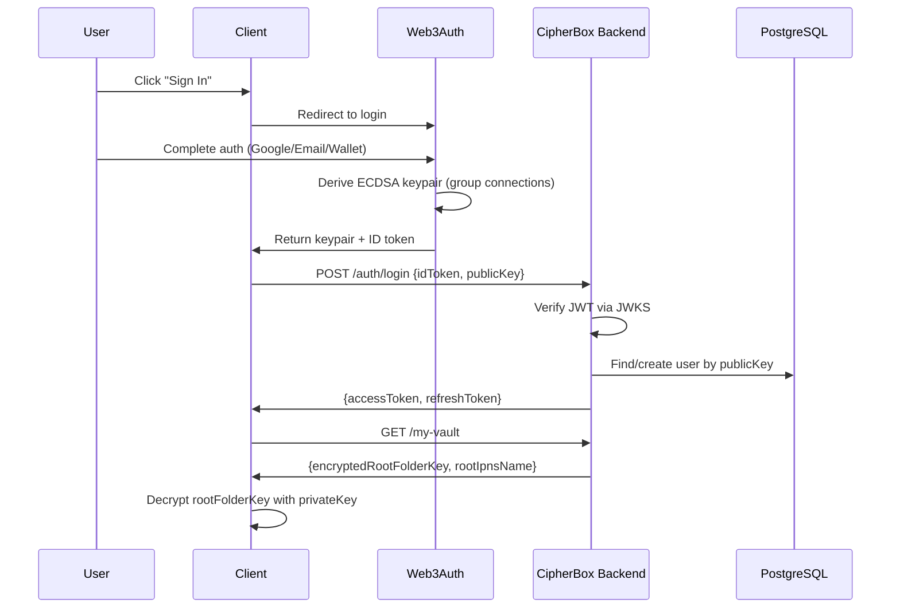
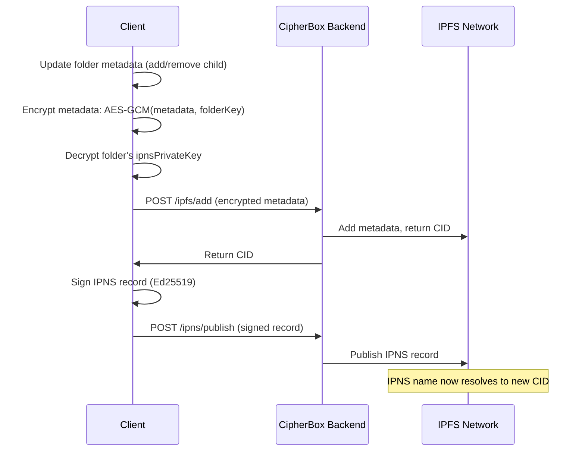
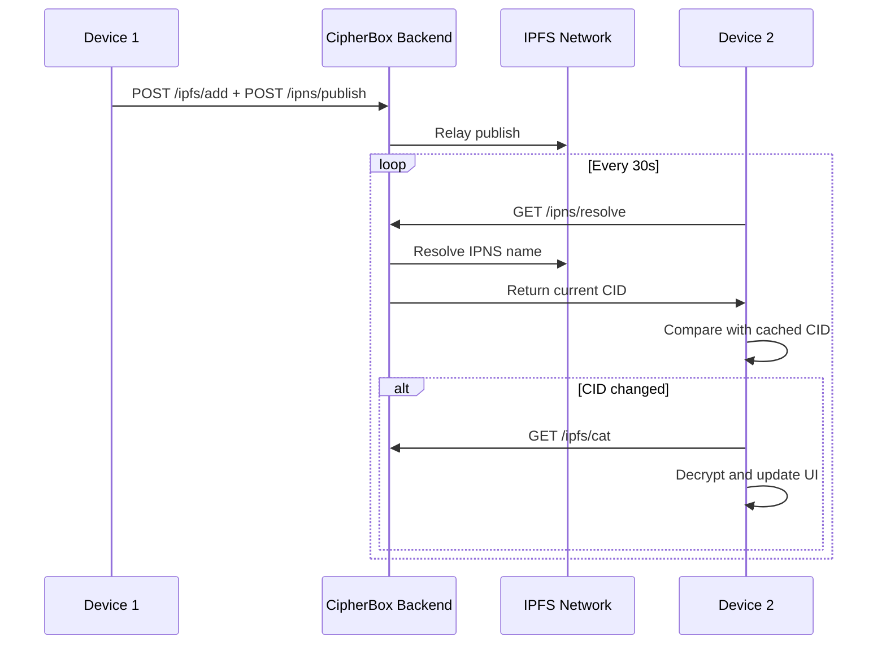

# CipherBox - Technical Architecture

**Document Type:** Technical Specification  
**Status:** Active  
**Last Updated:** January 17, 2026  

---

## Table of Contents

1. [System Overview](#1-system-overview)
2. [Authentication Architecture](#2-authentication-architecture)
3. [Encryption Architecture](#3-encryption-architecture)
4. [Key Management](#4-key-management)
5. [IPFS & IPNS Architecture](#5-ipfs--ipns-architecture)
6. [Tech Stack](#6-tech-stack)
7. [Threat Model](#7-threat-model)
8. [Acceptance Criteria](#8-acceptance-criteria)

---

## Terminology

| Term | Code/API | Prose | Notes |
|------|----------|-------|-------|
| Root folder encryption key | `rootFolderKey` | root folder key | AES-256 symmetric key |
| User's ECDSA public key | `publicKey` | public key | secp256k1 curve |
| User's ECDSA private key | `privateKey` | private key | Never stored/transmitted |
| IPNS identifier | `ipnsName` | IPNS name | e.g., k51qzi5uqu5dlvj55... |
| IPNS signed data structure | `ipnsRecord` | IPNS record | Contains encrypted metadata |
| Folder encryption key | `folderKey` | folder key | Per-folder AES-256 key |
| File encryption key | `fileKey` | file key | Per-file AES-256 key |
| IPNS signing key | `ipnsPrivateKey` | IPNS private key | Ed25519, stored encrypted |

---

## 1. System Overview

### 1.1 Architecture Diagram

```
┌─────────────────────────────────────────────────────────────┐
│                    End User Devices                         │
├─────────────────────────────────────────────────────────────┤
│  ┌──────────────────┐  ┌──────────────────┐                 │
│  │   Web Browser    │  │  Desktop App     │                 │
│  │   (React 18)     │  │  (Tauri/Electron)│                 │
│  │  FUSE: No        │  │  FUSE: Yes       │                 │
│  └────────┬─────────┘  └────────┬─────────┘                 │
│           └──────────┬──────────┘                           │
└──────────────────────┼──────────────────────────────────────┘
                       │
          ┌────────────┴────────────┐
          │                         │
          ▼                         ▼
   ┌──────────────┐          ┌─────────────────┐
   │  Web3Auth    │          │  CipherBox      │
   │  Network     │          │  Backend        │
   │              │          │  (NestJS)       │
   │ • Auth UI    │          │                 │
   │ • OAuth      │          │ • JWT/SIWE auth │
   │ • Key derive │          │ • Token mgmt    │
   │ • Group conn │          │ • File upload   │
   │              │          │ • Vault mgmt    │
   └──────────────┘          └────────┬────────┘
                                      │
                     ┌────────────────┼────────────────┐
                     │                │                │
                     ▼                ▼                ▼
             ┌────────────┐    ┌──────────┐    ┌─────────┐
             │ PostgreSQL │    │ Pinata   │    │ IPFS    │
             │            │    │ (Pinning)│    │ Network │
             │ • Users    │    │          │    │         │
             │ • Vaults   │    │ Pins     │    │ P2P     │
             │ • Tokens   │    │ encrypted│    │ Storage │
             │ • Audit    │    │ data     │    │         │
             └────────────┘    └──────────┘    └─────────┘
```

### 1.2 Core Principles

1. **Zero-Knowledge Server:** Backend never holds plaintext files or unencrypted keys
2. **Client-Side Encryption:** All encryption/decryption happens in browser or desktop app
3. **Deterministic Keys:** Same user + any linked auth method → same ECDSA keypair
4. **Decentralized Storage:** Files stored on IPFS, metadata in IPNS records
5. **User-Held Keys:** Private key exists only in client RAM during session
6. **Signed-Record Relay:** Clients sign IPNS records; backend relays to IPFS/IPNS

---

## 2. Authentication Architecture

### 2.1 Two-Phase Authentication

CipherBox uses a two-phase authentication approach:

1. **Phase 1 (Web3Auth):** User authenticates to derive ECDSA keypair
2. **Phase 2 (CipherBox Backend):** User authenticates to obtain access/refresh tokens



### 2.2 Supported Auth Methods (via Web3Auth)

| Method | Flow | Notes |
|--------|------|-------|
| Email + Password | Web3Auth verifies credentials | Password never sent to CipherBox |
| OAuth (Google/Apple/GitHub) | Standard OAuth via Web3Auth | Token verified by Web3Auth |
| Magic Link | Email link via Web3Auth | Passwordless |
| External Wallet | MetaMask/WalletConnect signature | Trustless, wallet proves identity |

### 2.3 Web3Auth Group Connections

All auth methods in the same group derive identical ECDSA keypairs:

```typescript
const modalConfig = {
  connectors: {
    [WALLET_CONNECTORS.AUTH]: {
      loginMethods: {
        google: {
          authConnectionId: 'w3a-google',
          groupedAuthConnectionId: 'cipherbox-aggregate',  // Group ID
        },
        email_passwordless: {
          authConnectionId: 'w3a-email-passwordless',
          groupedAuthConnectionId: 'cipherbox-aggregate',  // Same group
        },
      },
    },
  },
};
```

**Key Property:** `same user + any grouped auth method → same keypair → same vault`

### 2.4 CipherBox Backend Authentication Options

After Web3Auth key derivation, client authenticates with backend:

**Option A: Web3Auth ID Token (JWT)**
- Client sends ID token to backend
- Backend verifies via Web3Auth JWKS endpoint
- Simpler flow, relies on Web3Auth token signing

**Option B: SIWE-like Signature**
- Client requests nonce from backend
- Client signs message with private key
- Backend verifies signature recovers to claimed public key
- More control, doesn't rely on Web3Auth tokens

### 2.5 Token Architecture

| Token | Issuer | Expiry | Storage | Purpose |
|-------|--------|--------|---------|---------|
| Web3Auth ID Token | Web3Auth | 1 hour | Memory | Authenticate with CipherBox backend |
| Access Token | CipherBox | 15 min | Memory only | API authorization |
| Refresh Token | CipherBox | 7 days | HTTP-only cookie or encrypted storage | Obtain new access tokens |

### 2.6 Web3Auth Key Export (Recovery Path)

Users can export their Web3Auth private key for disaster recovery:

```
Normal flow: User → Web3Auth → keypair → vault access

Recovery flow (Web3Auth unavailable):
1. User has previously exported Web3Auth private key
2. User imports key directly into CipherBox recovery tool
3. Tool derives publicKey from privateKey
4. Tool decrypts vault export using privateKey
5. User has full vault access without Web3Auth

Note: Direct key import bypasses Web3Auth entirely.
Future implementation can support this as fallback.
```

---

## 3. Encryption Architecture

### 3.1 Encryption Primitives

| Algorithm | Purpose | Standard | Implementation |
|-----------|---------|----------|----------------|
| AES-256-GCM | File content + metadata encryption | NIST | Web Crypto API |
| ECIES (secp256k1) | Key wrapping (asymmetric encryption of symmetric keys) | SEC 2 | ethers.js |
| ECDSA (secp256k1) | Signing, key derivation | NIST/SECG | Web3Auth |
| Ed25519 | IPNS record signing | RFC 8032 | libsodium.js |
| HKDF-SHA256 | Key derivation | RFC 5869 | Web Crypto API |
| SHA-256 | Hashing | NIST | Web Crypto API |

### 3.2 File Encryption

Each file is encrypted with a unique random key:

```
1. Generate random fileKey (256-bit AES key)
2. Generate random IV (96-bit for GCM)
3. Encrypt file content:
   ciphertext = AES-256-GCM(plaintext, fileKey, IV)
   Output: ciphertext + 16-byte authentication tag

4. Wrap fileKey with user's public key:
   encryptedFileKey = ECIES(fileKey, publicKey)
   Output: ephemeral_pubkey || nonce || ciphertext || auth_tag

5. Store in folder metadata:
   - cid: IPFS content identifier
   - fileKeyEncrypted: wrapped key
   - fileIv: IV for decryption
```

### 3.3 Folder Metadata Encryption

Folder metadata (child list) is encrypted with the folder's key:

```
1. Serialize metadata to JSON
2. Generate random IV (96-bit)
3. Encrypt:
   encryptedMetadata = AES-256-GCM(metadataJson, folderKey, IV)

4. Store in IPNS record:
   {
     "version": "1.0",
     "encryptedMetadata": "0x...",
     "iv": "0x...",
     "signature": "..." // IPNS signature
   }
```

### 3.4 Decrypted Metadata Structure

```json
{
  "children": [
    {
      "type": "folder",
      "nameEncrypted": "0x...",
      "nameIv": "0x...",
      "ipnsName": "k51qzi5uqu5dlvj66...",
      "ipnsPrivateKeyEncrypted": "0x...",
      "folderKeyEncrypted": "0x...",
      "created": 1705268100,
      "modified": 1705268100
    },
    {
      "type": "file",
      "nameEncrypted": "0x...",
      "nameIv": "0x...",
      "cid": "QmXxxx...",
      "fileKeyEncrypted": "0x...",
      "fileIv": "0x...",
      "size": 2048576,
      "created": 1705268100,
      "modified": 1705268100
    }
  ],
  "metadata": {
    "created": 1705268100,
    "modified": 1705268100
  }
}
```

### 3.5 No File Deduplication

CipherBox does NOT deduplicate files. Each upload uses:
- Unique random 256-bit AES key
- Unique random 96-bit IV

Same file uploaded twice produces different ciphertexts and different CIDs. This is a security feature—deduplication would leak information about file contents.

---

## 4. Key Management

### 4.1 Key Hierarchy

```
User Authentication (Web3Auth)
    │
    ▼
ECDSA Keypair (secp256k1)
    │
    ├─► privateKey
    │   • Client RAM only
    │   • Never transmitted
    │   • Never persisted
    │   • Used for: ECIES decrypt, SIWE sign
    │   • Destroyed on logout
    │
    └─► publicKey
        • Stored on CipherBox server
        • Used to identify user
        • Used to encrypt all data keys

Root Folder Key (AES-256)
    │
    ├─► Generated on vault init
    ├─► Stored encrypted on server: ECIES(rootFolderKey, publicKey)
    └─► Decrypted client-side on login

Root IPNS Private Key (Ed25519)
    │
    ├─► Generated on vault init
    ├─► Stored encrypted on server: ECIES(ipnsPrivateKey, publicKey)
    └─► Decrypted client-side for IPNS publishing

Subfolder Keys (AES-256, one per folder)
    │
    ├─► Generated on folder creation
    ├─► Stored encrypted in parent metadata
    └─► Decrypted when traversing tree

File Keys (AES-256, one per file)
    │
    ├─► Generated on file upload
    ├─► Stored encrypted in folder metadata
    └─► Decrypted when downloading
```

### 4.2 Key Storage Summary

| Key | Storage Location | Encrypted With | When Decrypted |
|-----|------------------|----------------|----------------|
| privateKey | Client RAM only | N/A | Session lifetime |
| publicKey | Server (Users table) | N/A (public) | N/A |
| rootFolderKey | Server (Vaults table) | ECIES(publicKey) | On login |
| rootIpnsPrivateKey | Server (Vaults table) | ECIES(publicKey) | On login |
| folderKey | Parent IPNS record | ECIES(publicKey) | On folder access |
| fileKey | Folder IPNS record | ECIES(publicKey) | On file download |
| ipnsPrivateKey (subfolder) | Parent IPNS record | ECIES(publicKey) | On folder write |

### 4.3 Key Lifecycle

**Session Start:**
1. User authenticates via Web3Auth
2. privateKey reconstructed in client RAM
3. Client fetches encrypted rootFolderKey from server
4. Client decrypts rootFolderKey with privateKey
5. Session active

**Session End:**
1. User clicks logout (or session expires)
2. Clear privateKey from memory
3. Clear rootFolderKey from memory
4. Clear all cached folder keys
5. Clear all tokens

### 4.4 PoC Local Key Bootstrap (Console Harness)

The console PoC bypasses Web3Auth and the backend. It uses a locally provided `privateKey` and persists only the minimum vault state to disk for the duration of the run.

**PoC bootstrap rules:**
- Load `privateKey` from `.env` (client-only, never logged)
- Derive `publicKey` locally (secp256k1)
- Generate `rootFolderKey` and store on disk for the run
- Generate per-folder IPNS keys on the local IPFS node
- Store the IPNS key **name** encrypted with ECIES in folder metadata (stand-in for `ipnsPrivateKey`), while the actual IPNS private key remains in the local IPFS keystore

**Teardown:**
- Unpin all file and folder metadata CIDs created during the run
- Remove any IPNS keys created in the local IPFS keystore

---

## 5. IPFS & IPNS Architecture

### 5.1 Per-Folder IPNS Records

Each folder has its own IPNS record with dedicated keypair:

```
Root Folder
├─► IPNS Name: k51qzi5uqu5dlvj55...
├─► IPNS Private Key: stored encrypted on server
└─► Contains: encrypted list of children

Subfolder (Documents)
├─► IPNS Name: k51qzi5uqu5dlvj66...
├─► IPNS Private Key: stored encrypted in parent metadata
└─► Contains: encrypted list of children
```

This design enables future per-folder sharing (v2+).

### 5.2 IPNS Publishing Flow



**Key Point:** Client signs IPNS records locally; backend relays signed records only. Private keys never leave client.

### 5.3 Tree Traversal

```typescript
async function fetchFileTree(ipnsName: string, folderKey: Uint8Array): Promise<FolderNode> {
  // 1. Resolve IPNS via backend relay
  const { cid } = await api.get(`/ipns/resolve?ipnsName=${ipnsName}`);
  
  // 2. Fetch encrypted metadata from IPFS
  const encryptedData = await api.get(`/ipfs/cat?cid=${cid}`, { responseType: "arraybuffer" });
  const { encryptedMetadata, iv } = JSON.parse(encryptedData);
  
  // 3. Decrypt metadata
  const metadataJson = AES256GCM_Decrypt(encryptedMetadata, folderKey, iv);
  const metadata = JSON.parse(metadataJson);
  
  // 4. Process children
  const tree = { children: [] };
  for (const child of metadata.children) {
    if (child.type === "folder") {
      // Decrypt subfolder key
      const subfolderKey = ECIES_Decrypt(child.folderKeyEncrypted, privateKey);
      // Recursively fetch subfolder
      const childTree = await fetchFileTree(child.ipnsName, subfolderKey);
      tree.children.push({ type: "folder", name: decrypt(child.nameEncrypted), subtree: childTree });
    } else {
      tree.children.push({ type: "file", name: decrypt(child.nameEncrypted), cid: child.cid });
    }
  }
  return tree;
}
```

### 5.4 Sync via IPNS Polling



### 5.5 Conflict Resolution (v1)

For v1, IPFS network determines which IPNS update wins:
- IPNS records have sequence numbers
- Latest valid record (highest sequence) wins
- No application-level conflict resolution

Future versions may implement vector clocks or CRDTs.

---

## 6. Tech Stack

| Component | Technology | Rationale |
|-----------|------------|-----------|
| Frontend | React 18 + TypeScript | Modern, good for encryption UI |
| Web Crypto | Web Crypto API | Native browser encryption |
| IPFS Client | CipherBox IPFS relay | HTTP relay to IPFS/IPNS |
| Web3Auth SDK | @web3auth/modal | Auth and key derivation |
| Backend | Node.js + NestJS + TypeScript | Type-safe, same language as frontend |
| JWT Verification | jose | Verify Web3Auth tokens |
| Database | PostgreSQL | ACID, structured data |
| IPFS Pinning | Pinata API | Managed pinning service |
| Desktop (macOS) | Tauri or Electron | FUSE support |
| FUSE (macOS) | macFUSE | Userland filesystem |

---

## 7. Threat Model

### 7.1 Server Compromise

**Scenario:** Attacker gains access to CipherBox database and code.

**What attacker has:**
- Encrypted root folder keys
- User public keys
- Refresh token hashes
- IPNS names

**What attacker cannot do:**
- Decrypt any files (no private keys)
- Impersonate users (refresh tokens are hashed)
- Access vault contents (all encrypted)

**Mitigation:** Private keys never stored on server. Zero-knowledge architecture.

### 7.2 Web3Auth Compromise

**Scenario:** Attacker compromises Web3Auth infrastructure.

**Impact:** Could potentially derive user keypairs (requires compromising threshold of nodes).

**Mitigation:**
- Web3Auth uses threshold cryptography (no single point of failure)
- Users can export keys for independent recovery
- SIWE auth validates identity without relying on Web3Auth tokens

### 7.3 Network Interception

**Scenario:** Attacker intercepts HTTPS traffic.

**What attacker sees:**
- Ciphertexts (encrypted files)
- IPFS CIDs
- Public keys

**What attacker cannot do:**
- Decrypt ciphertexts (no private keys)
- Derive private key from public key

**Mitigation:** HTTPS enforced, all sensitive data encrypted.

### 7.4 Client Compromise

**Scenario:** Attacker gains control of user's device during active session.

**Impact:** Attacker can access private key in RAM.

**Mitigation:**
- Keys discarded on logout
- Short access token expiry (15 min)
- External wallet auth requires wallet approval

### 7.5 Refresh Token Theft

**Scenario:** Attacker steals refresh token.

**Impact:** Attacker can obtain new access tokens, impersonate user.

**Mitigation:**
- Refresh token rotation (new token on each use)
- Secure storage (HTTP-only cookie)
- Short access token expiry limits exposure

---

## 8. Acceptance Criteria

### 8.1 Security Criteria

| ID | Criterion | Test Method | Owner |
|----|-----------|-------------|-------|
| S1 | Private key never written to localStorage/sessionStorage | Unit test: mock storage, verify no writes | Frontend |
| S2 | Private key cleared from memory on logout | Integration test: verify state cleared | Frontend |
| S3 | All /vault/upload requests contain only encrypted content | Network inspection test | QA |
| S4 | ECIES decryption fails with wrong private key | Unit test: decrypt with random key | Frontend |
| S5 | AES-GCM decryption detects tampering | Unit test: modify ciphertext, verify failure | Frontend |
| S6 | Refresh tokens stored as SHA-256 hash only | DB inspection | Backend |
| S7 | SIWE nonces deleted after single use | Integration test: replay attack fails | Backend |
| S8 | No private keys in application logs | Log audit | DevOps |
| S9 | HTTPS enforced on all endpoints | Deployment config review | DevOps |

### 8.2 Encryption Criteria

| ID | Criterion | Test Method | Owner |
|----|-----------|-------------|-------|
| E1 | Same file uploaded twice produces different CIDs | Integration test | Frontend |
| E2 | File decryption produces original content | Round-trip test | Frontend |
| E3 | Folder metadata decryption produces valid JSON | Integration test | Frontend |
| E4 | Key derivation is deterministic across auth methods | Cross-method login test | Frontend |

### 8.3 Performance Criteria

| ID | Criterion | Target | Test Method | Owner |
|----|-----------|--------|-------------|-------|
| P1 | Auth flow (Web3Auth + backend) | <3s P95 | Load test | Backend |
| P2 | File encryption (<100MB) | <2s | Benchmark | Frontend |
| P3 | File upload (<100MB) | <5s P95 | Integration test | QA |
| P4 | IPNS resolution (cached) | <200ms | Integration test | Frontend |
| P5 | IPNS resolution (uncached) | <2s | Integration test | Frontend |
| P6 | Tree traversal (1000 files) | <2s | Benchmark | Frontend |

---

## Related Documents

- [PRD.md](./PRD.md) - Product requirements and user journeys
- [API_SPECIFICATION.md](./API_SPECIFICATION.md) - Backend endpoints and database schema
- [DATA_FLOWS.md](./DATA_FLOWS.md) - Detailed sequence diagrams and test vectors
- [CLIENT_SPECIFICATION.md](./CLIENT_SPECIFICATION.md) - Web UI and desktop app specifications

---

**End of Technical Architecture**
