# CipherBox - Data Flows

**Document Type:** Implementation Reference
**Status:** Active
**Last Updated:** January 19, 2026  

---

## Table of Contents

1. [Authentication Flow](#1-authentication-flow)
2. [File Upload Flow](#2-file-upload-flow)
3. [File Download Flow](#3-file-download-flow)
4. [Multi-Device Sync Flow](#4-multi-device-sync-flow)
5. [Vault Export & Recovery Flow](#5-vault-export--recovery-flow)
6. [Write Operations](#6-write-operations)
7. [Test Vectors](#7-test-vectors)
8. [Console PoC Harness Flow](#8-console-poc-harness-flow)

---

## Terminology

| Term | Code/API | Prose |
|------|----------|-------|
| Root folder encryption key | `rootFolderKey` | root folder key |
| User's ECDSA public key | `publicKey` | public key |
| User's ECDSA private key | `privateKey` | private key |
| IPNS identifier | `ipnsName` | IPNS name |
| Folder encryption key | `folderKey` | folder key |
| File encryption key | `fileKey` | file key |

---

## 1. Authentication Flow

### 1.1 Complete Auth Flow (JWT)

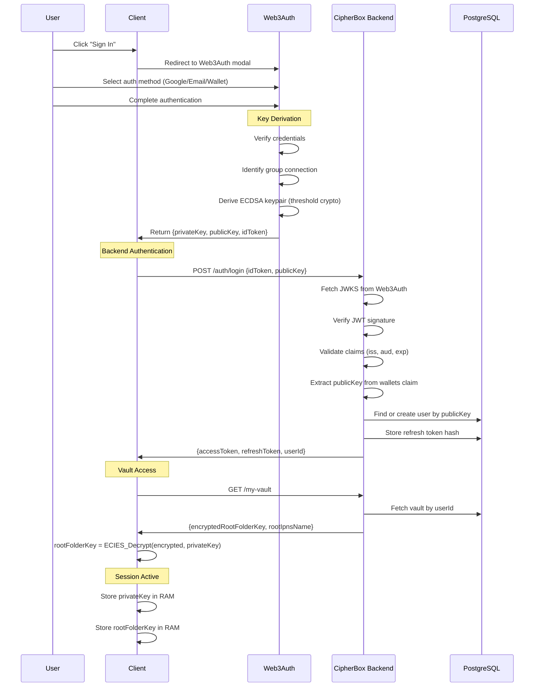
```mermaid
sequenceDiagram
    participant U as User
    participant C as Client
    participant W as Web3Auth
    participant B as CipherBox Backend
    participant DB as PostgreSQL
    
    U->>C: Click "Sign In"
    C->>W: Redirect to Web3Auth modal
    U->>W: Select auth method (Google/Email/Wallet)
    U->>W: Complete authentication
    
    Note over W: Key Derivation
    W->>W: Verify credentials
    W->>W: Identify group connection
    W->>W: Derive ECDSA keypair (threshold crypto)
    W->>C: Return {privateKey, publicKey, idToken}
    
    Note over C: Backend Authentication
    C->>B: POST /auth/login {idToken, publicKey}
    B->>B: Fetch JWKS from Web3Auth
    B->>B: Verify JWT signature
    B->>B: Validate claims (iss, aud, exp)
    B->>B: Extract publicKey from wallets claim
    B->>DB: Find or create user by publicKey
    B->>DB: Store refresh token hash
    B->>C: {accessToken, refreshToken, userId}
    
    Note over C: Vault Access
    C->>B: GET /my-vault
    B->>DB: Fetch vault by userId
    B->>C: {encryptedRootFolderKey, rootIpnsName}
    C->>C: rootFolderKey = ECIES_Decrypt(encrypted, privateKey)
    
    Note over C: Session Active
    C->>C: Store privateKey in RAM
    C->>C: Store rootFolderKey in RAM
```

### 1.2 SIWE Authentication Flow

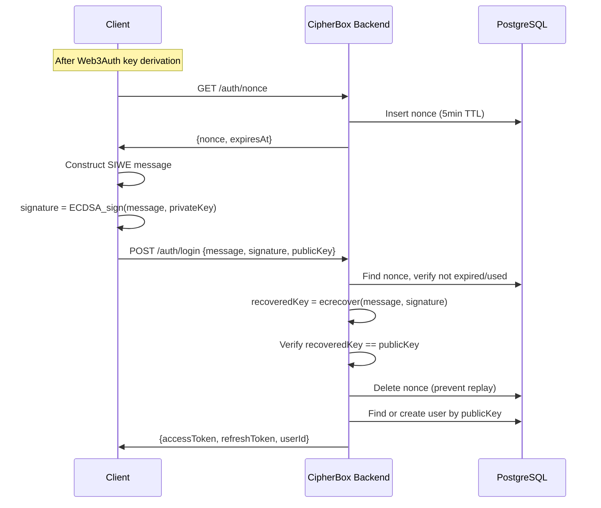
```mermaid
sequenceDiagram
    participant C as Client
    participant B as CipherBox Backend
    participant DB as PostgreSQL
    
    Note over C: After Web3Auth key derivation
    
    C->>B: GET /auth/nonce
    B->>DB: Insert nonce (5min TTL)
    B->>C: {nonce, expiresAt}
    
    C->>C: Construct SIWE message
    C->>C: signature = ECDSA_sign(message, privateKey)
    
    C->>B: POST /auth/login {message, signature, publicKey}
    B->>DB: Find nonce, verify not expired/used
    B->>B: recoveredKey = ecrecover(message, signature)
    B->>B: Verify recoveredKey == publicKey
    B->>DB: Delete nonce (prevent replay)
    B->>DB: Find or create user by publicKey
    B->>C: {accessToken, refreshToken, userId}
```

### 1.3 Token Refresh Flow

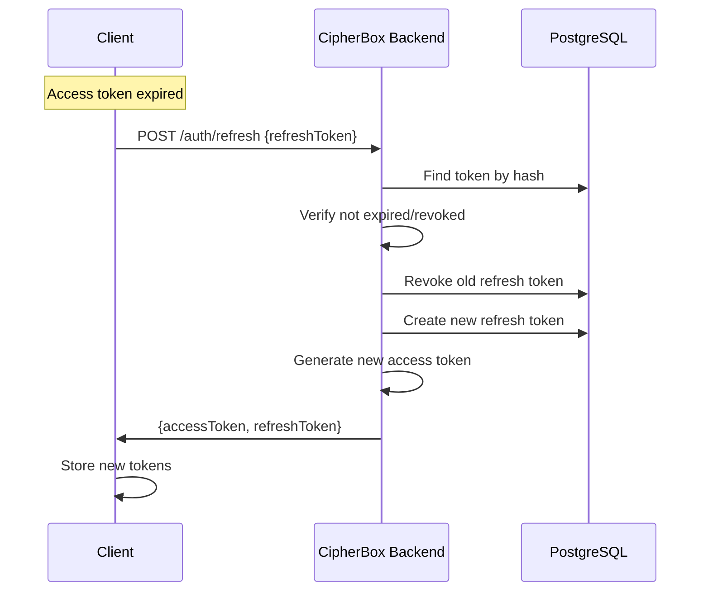
```mermaid
sequenceDiagram
    participant C as Client
    participant B as CipherBox Backend
    participant DB as PostgreSQL
    
    Note over C: Access token expired
    
    C->>B: POST /auth/refresh {refreshToken}
    B->>DB: Find token by hash
    B->>B: Verify not expired/revoked
    B->>DB: Revoke old refresh token
    B->>DB: Create new refresh token
    B->>B: Generate new access token
    B->>C: {accessToken, refreshToken}
    
    C->>C: Store new tokens
```

---

## 2. File Upload Flow

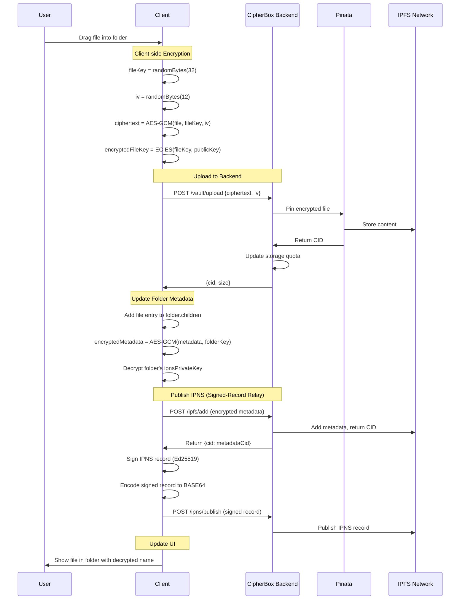
```mermaid
sequenceDiagram
    participant U as User
    participant C as Client
    participant B as CipherBox Backend
    participant P as Pinata
    participant IPFS as IPFS Network
    
    U->>C: Drag file into folder
    
    Note over C: Client-side Encryption
    C->>C: fileKey = randomBytes(32)
    C->>C: iv = randomBytes(12)
    C->>C: ciphertext = AES-GCM(file, fileKey, iv)
    C->>C: encryptedFileKey = ECIES(fileKey, publicKey)
    
    Note over C,B: Upload to Backend
    C->>B: POST /vault/upload {ciphertext, iv}
    B->>P: Pin encrypted file
    P->>IPFS: Store content
    P->>B: Return CID
    B->>B: Update storage quota
    B->>C: {cid, size}
    
    Note over C: Update Folder Metadata
    C->>C: Add file entry to folder.children
    C->>C: encryptedMetadata = AES-GCM(metadata, folderKey)
    C->>C: Decrypt folder's ipnsPrivateKey
    
    Note over C,B: Publish IPNS (Signed-Record Relay)
    C->>B: POST /ipfs/add (encrypted metadata)
    B->>IPFS: Add metadata, return CID
    B->>C: Return {cid: metadataCid}
    C->>C: Sign IPNS record (Ed25519)
    C->>C: Encode signed record to BASE64
    C->>B: POST /ipns/publish (signed record)
    B->>IPFS: Publish IPNS record
    
    Note over C: Update UI
    C->>U: Show file in folder with decrypted name
```

### 2.1 File Entry Structure

After upload, this entry is added to folder metadata:

```json
{
  "type": "file",
  "nameEncrypted": "AES-GCM(filename, folderKey)",
  "nameIv": "0x...",
  "cid": "QmXxxx...",
  "fileKeyEncrypted": "ECIES(fileKey, publicKey)",
  "fileIv": "0x...",
  "encryptionMode": "GCM",
  "size": 2048576,
  "created": 1705268100,
  "modified": 1705268100
}
```

**Field Notes:**
- `encryptionMode`: Specifies file encryption algorithm ("GCM" or "CTR"). Always "GCM" in v1.0. Required for v1.1+ streaming support.
- Client decryption must default to "GCM" if field is missing (backward compatibility).

---

## 3. File Download Flow

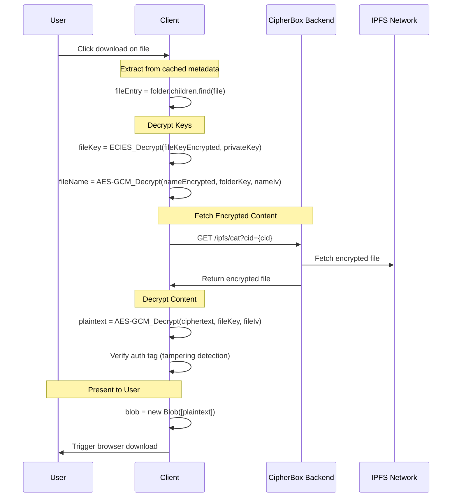
```mermaid
sequenceDiagram
    participant U as User
    participant C as Client
    participant B as CipherBox Backend
    participant IPFS as IPFS Network
    
    U->>C: Click download on file
    
    Note over C: Extract from cached metadata
    C->>C: fileEntry = folder.children.find(file)
    
    Note over C: Decrypt Keys
    C->>C: fileKey = ECIES_Decrypt(fileKeyEncrypted, privateKey)
    C->>C: fileName = AES-GCM_Decrypt(nameEncrypted, folderKey, nameIv)
    
    Note over C,B: Fetch Encrypted Content
    C->>B: GET /ipfs/cat?cid={cid}
    B->>IPFS: Fetch encrypted file
    B->>C: Return encrypted file
    
    Note over C: Decrypt Content
    C->>C: plaintext = AES-GCM_Decrypt(ciphertext, fileKey, fileIv)
    C->>C: Verify auth tag (tampering detection)
    
    Note over C,U: Present to User
    C->>C: blob = new Blob([plaintext])
    C->>U: Trigger browser download
```

---

## 4. Multi-Device Sync Flow

### 4.1 Sync Detection via Polling

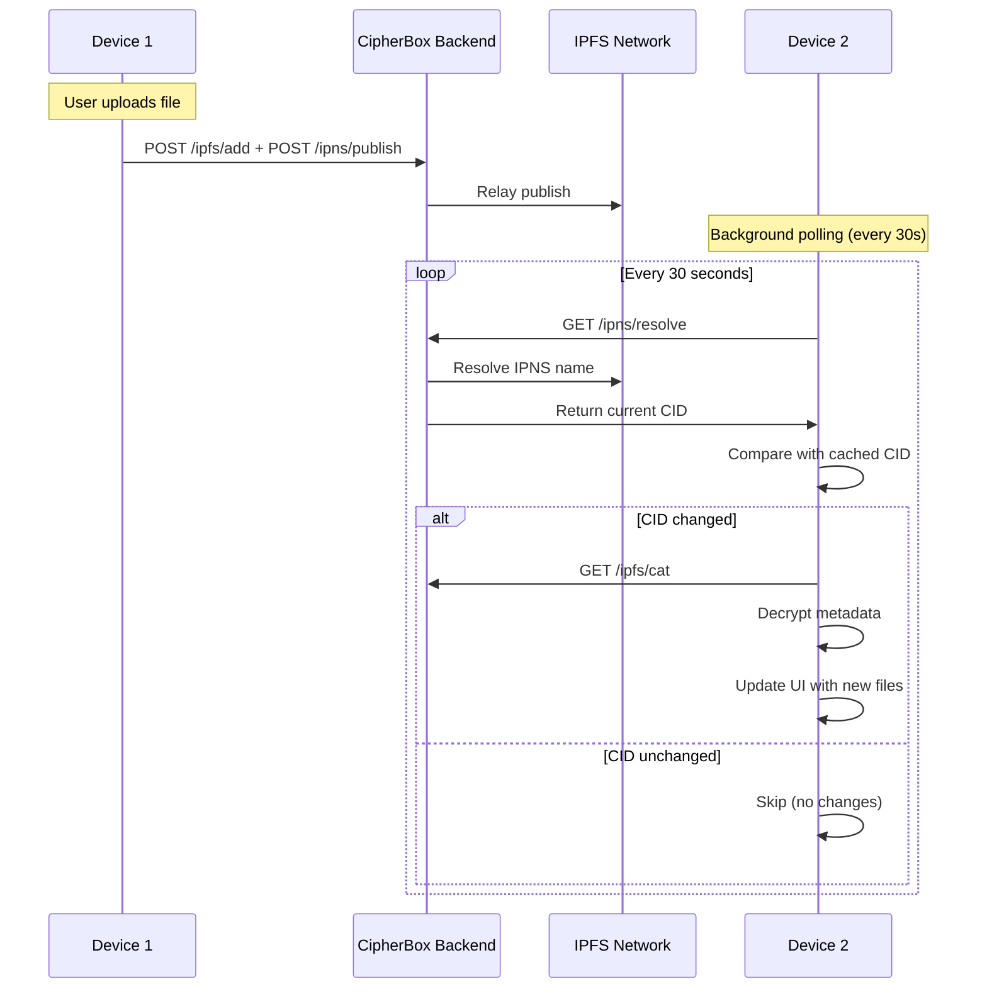
```mermaid
sequenceDiagram
    participant D1 as Device 1
    participant B as CipherBox Backend
    participant IPFS as IPFS Network
    participant D2 as Device 2
    
    Note over D1: User uploads file
    D1->>B: POST /ipfs/add + POST /ipns/publish
    B->>IPFS: Relay publish
    
    Note over D2: Background polling (every 30s)
    loop Every 30 seconds
      D2->>B: GET /ipns/resolve
      B->>IPFS: Resolve IPNS name
      B->>D2: Return current CID
        D2->>D2: Compare with cached CID
        
        alt CID changed
        D2->>B: GET /ipfs/cat
            D2->>D2: Decrypt metadata
            D2->>D2: Update UI with new files
        else CID unchanged
            D2->>D2: Skip (no changes)
        end
    end
```

### 4.2 Sync Implementation

```typescript
async function pollForChanges() {
  // Get root IPNS name from vault
  const vault = await api.get('/my-vault');
  
  // Resolve IPNS to current CID
  const { cid: currentCid } = await api.get(`/ipns/resolve?ipnsName=${vault.rootIpnsName}`);
  
  // Check if changed
  if (currentCid === cachedRootCid) {
    console.log("No changes detected");
    return;
  }
  
  // Changes detected - fetch new metadata
  cachedRootCid = currentCid;
  const rootMetadata = await fetchAndDecryptMetadata(
    vault.rootIpnsName,
    rootFolderKey
  );
  
  // Update UI
  updateFileTree(rootMetadata);
}

// Start polling
setInterval(pollForChanges, 30000);
```

---

## 5. Vault Export & Recovery Flow

### 5.1 Export Flow

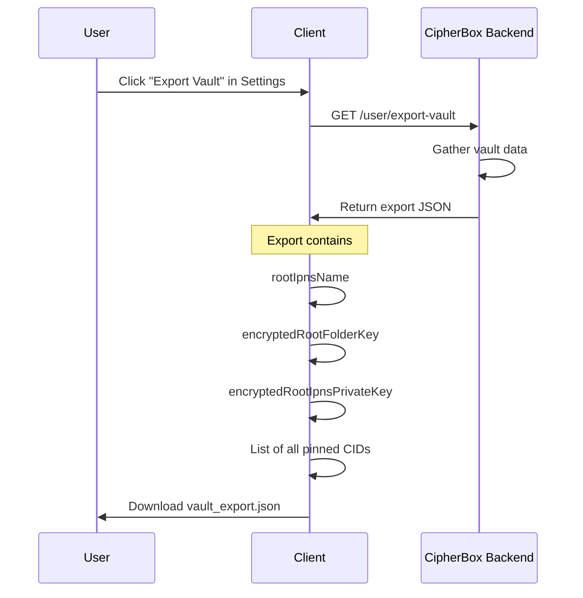
```mermaid
sequenceDiagram
    participant U as User
    participant C as Client
    participant B as CipherBox Backend
    
    U->>C: Click "Export Vault" in Settings
    C->>B: GET /user/export-vault
    
    B->>B: Gather vault data
    B->>C: Return export JSON
    
    Note over C: Export contains
    C->>C: rootIpnsName
    C->>C: encryptedRootFolderKey
    C->>C: encryptedRootIpnsPrivateKey
    C->>C: List of all pinned CIDs
    
    C->>U: Download vault_export.json
```

### 5.2 Recovery Flow (Without CipherBox)

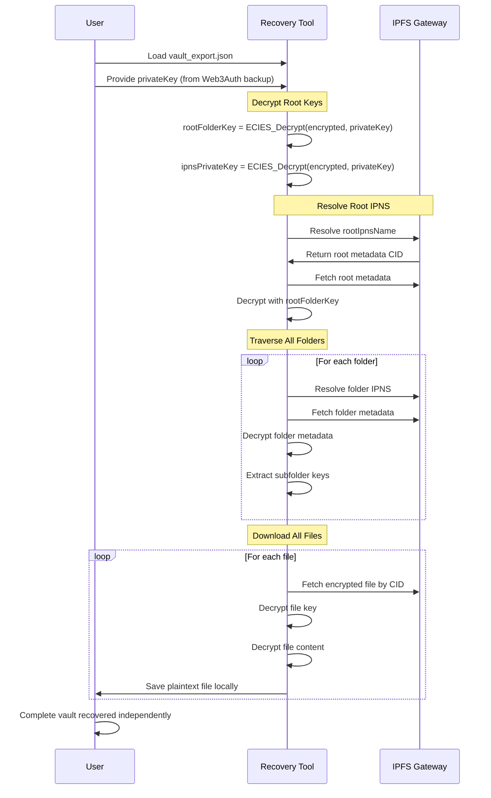
```mermaid
sequenceDiagram
    participant U as User
    participant R as Recovery Tool
    participant IPFS as IPFS Gateway
    
    U->>R: Load vault_export.json
    U->>R: Provide privateKey (from Web3Auth backup)
    
    Note over R: Decrypt Root Keys
    R->>R: rootFolderKey = ECIES_Decrypt(encrypted, privateKey)
    R->>R: ipnsPrivateKey = ECIES_Decrypt(encrypted, privateKey)
    
    Note over R,IPFS: Resolve Root IPNS
    R->>IPFS: Resolve rootIpnsName
    IPFS->>R: Return root metadata CID
    R->>IPFS: Fetch root metadata
    R->>R: Decrypt with rootFolderKey
    
    Note over R: Traverse All Folders
    loop For each folder
        R->>IPFS: Resolve folder IPNS
        R->>IPFS: Fetch folder metadata
        R->>R: Decrypt folder metadata
        R->>R: Extract subfolder keys
    end
    
    Note over R: Download All Files
    loop For each file
        R->>IPFS: Fetch encrypted file by CID
        R->>R: Decrypt file key
        R->>R: Decrypt file content
        R->>U: Save plaintext file locally
    end
    
    U->>U: Complete vault recovered independently
```

---

## 6. Write Operations

### 6.1 Create Folder

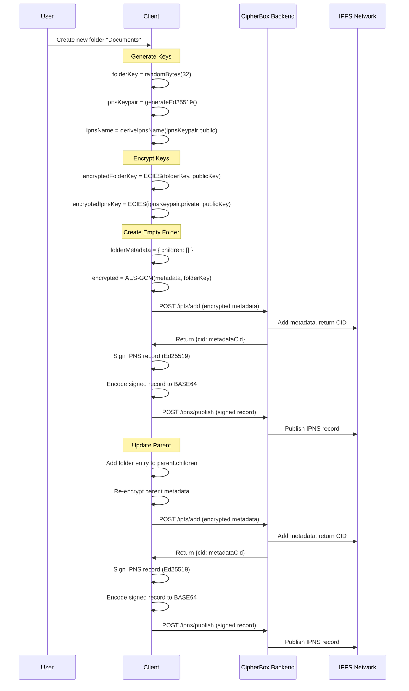
```mermaid
sequenceDiagram
    participant U as User
    participant C as Client
    participant B as CipherBox Backend
    participant IPFS as IPFS Network
    
    U->>C: Create new folder "Documents"
    
    Note over C: Generate Keys
    C->>C: folderKey = randomBytes(32)
    C->>C: ipnsKeypair = generateEd25519()
    C->>C: ipnsName = deriveIpnsName(ipnsKeypair.public)
    
    Note over C: Encrypt Keys
    C->>C: encryptedFolderKey = ECIES(folderKey, publicKey)
    C->>C: encryptedIpnsKey = ECIES(ipnsKeypair.private, publicKey)
    
    Note over C: Create Empty Folder
    C->>C: folderMetadata = { children: [] }
    C->>C: encrypted = AES-GCM(metadata, folderKey)
    C->>B: POST /ipfs/add (encrypted metadata)
    B->>IPFS: Add metadata, return CID
    B->>C: Return {cid: metadataCid}
    C->>C: Sign IPNS record (Ed25519)
    C->>C: Encode signed record to BASE64
    C->>B: POST /ipns/publish (signed record)
    B->>IPFS: Publish IPNS record
    
    Note over C: Update Parent
    C->>C: Add folder entry to parent.children
    C->>C: Re-encrypt parent metadata
    C->>B: POST /ipfs/add (encrypted metadata)
    B->>IPFS: Add metadata, return CID
    B->>C: Return {cid: metadataCid}
    C->>C: Sign IPNS record (Ed25519)
    C->>C: Encode signed record to BASE64
    C->>B: POST /ipns/publish (signed record)
    B->>IPFS: Publish IPNS record
```

### 6.2 Rename File/Folder

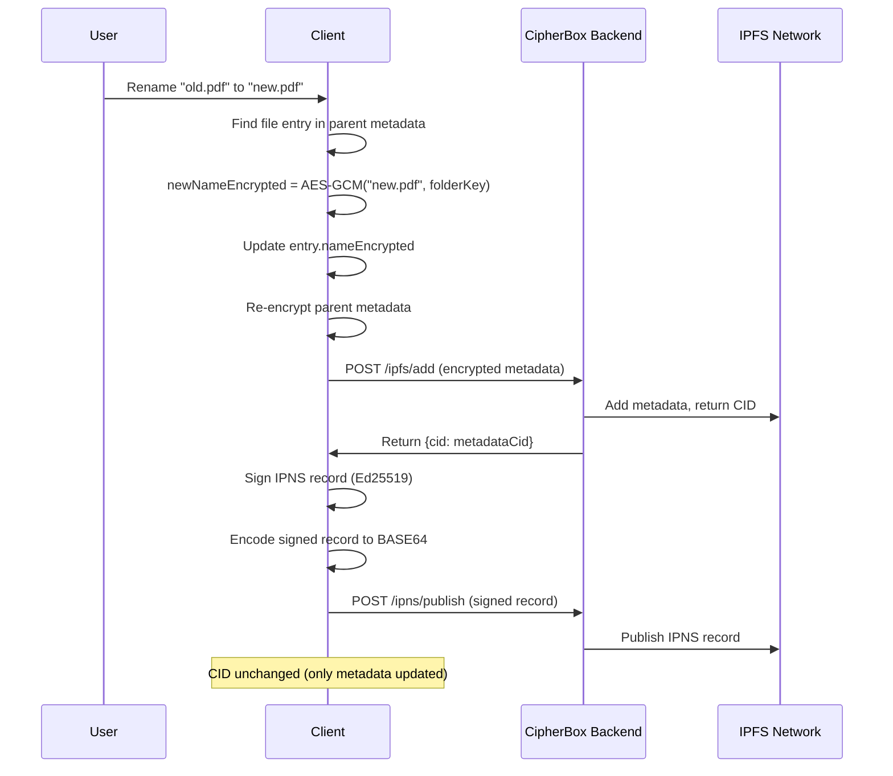
```mermaid
sequenceDiagram
    participant U as User
    participant C as Client
    participant B as CipherBox Backend
    participant IPFS as IPFS Network
    
    U->>C: Rename "old.pdf" to "new.pdf"
    
    C->>C: Find file entry in parent metadata
    C->>C: newNameEncrypted = AES-GCM("new.pdf", folderKey)
    C->>C: Update entry.nameEncrypted
    C->>C: Re-encrypt parent metadata
    C->>B: POST /ipfs/add (encrypted metadata)
    B->>IPFS: Add metadata, return CID
    B->>C: Return {cid: metadataCid}
    C->>C: Sign IPNS record (Ed25519)
    C->>C: Encode signed record to BASE64
    C->>B: POST /ipns/publish (signed record)
    B->>IPFS: Publish IPNS record
    
    Note over C: CID unchanged (only metadata updated)
```

### 6.3 Move File/Folder

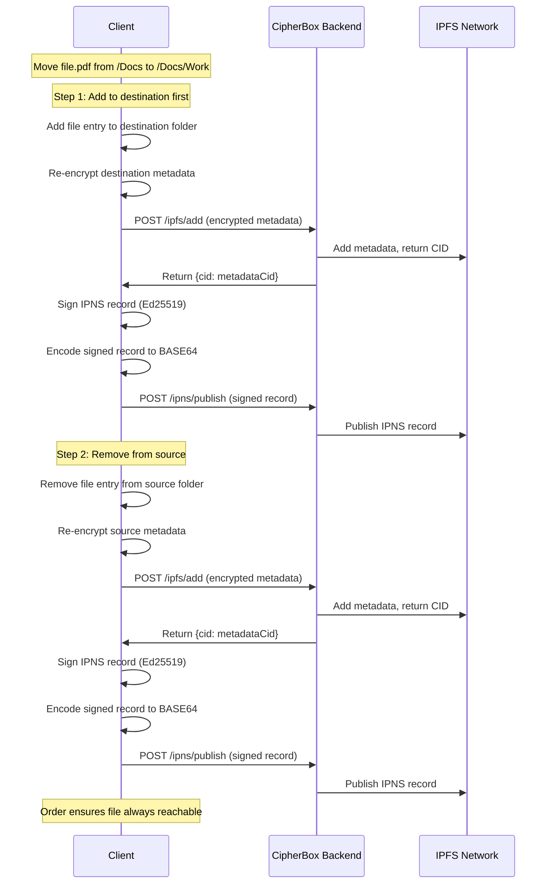
```mermaid
sequenceDiagram
    participant C as Client
    participant B as CipherBox Backend
    participant IPFS as IPFS Network
    
    Note over C: Move file.pdf from /Docs to /Docs/Work
    
    Note over C: Step 1: Add to destination first
    C->>C: Add file entry to destination folder
    C->>C: Re-encrypt destination metadata
    C->>B: POST /ipfs/add (encrypted metadata)
    B->>IPFS: Add metadata, return CID
    B->>C: Return {cid: metadataCid}
    C->>C: Sign IPNS record (Ed25519)
    C->>C: Encode signed record to BASE64
    C->>B: POST /ipns/publish (signed record)
    B->>IPFS: Publish IPNS record
    
    Note over C: Step 2: Remove from source
    C->>C: Remove file entry from source folder
    C->>C: Re-encrypt source metadata
    C->>B: POST /ipfs/add (encrypted metadata)
    B->>IPFS: Add metadata, return CID
    B->>C: Return {cid: metadataCid}
    C->>C: Sign IPNS record (Ed25519)
    C->>C: Encode signed record to BASE64
    C->>B: POST /ipns/publish (signed record)
    B->>IPFS: Publish IPNS record
    
    Note over C: Order ensures file always reachable
```

### 6.4 Delete File

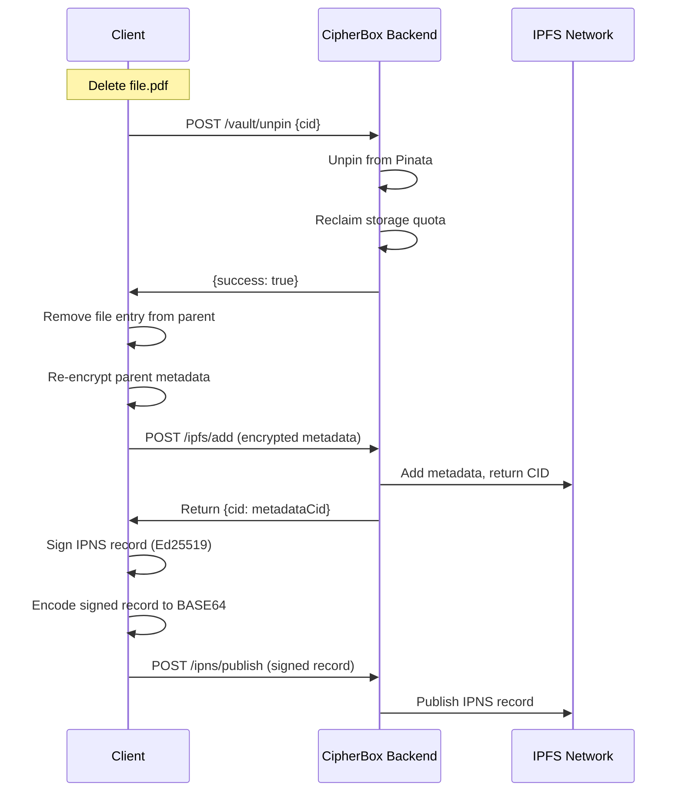
```mermaid
sequenceDiagram
    participant C as Client
    participant B as CipherBox Backend
    participant IPFS as IPFS Network
    
    Note over C: Delete file.pdf
    
    C->>B: POST /vault/unpin {cid}
    B->>B: Unpin from Pinata
    B->>B: Reclaim storage quota
    B->>C: {success: true}
    
    C->>C: Remove file entry from parent
    C->>C: Re-encrypt parent metadata
    C->>B: POST /ipfs/add (encrypted metadata)
    B->>IPFS: Add metadata, return CID
    B->>C: Return {cid: metadataCid}
    C->>C: Sign IPNS record (Ed25519)
    C->>C: Encode signed record to BASE64
    C->>B: POST /ipns/publish (signed record)
    B->>IPFS: Publish IPNS record
```

### 6.5 Update File (Replace Contents)

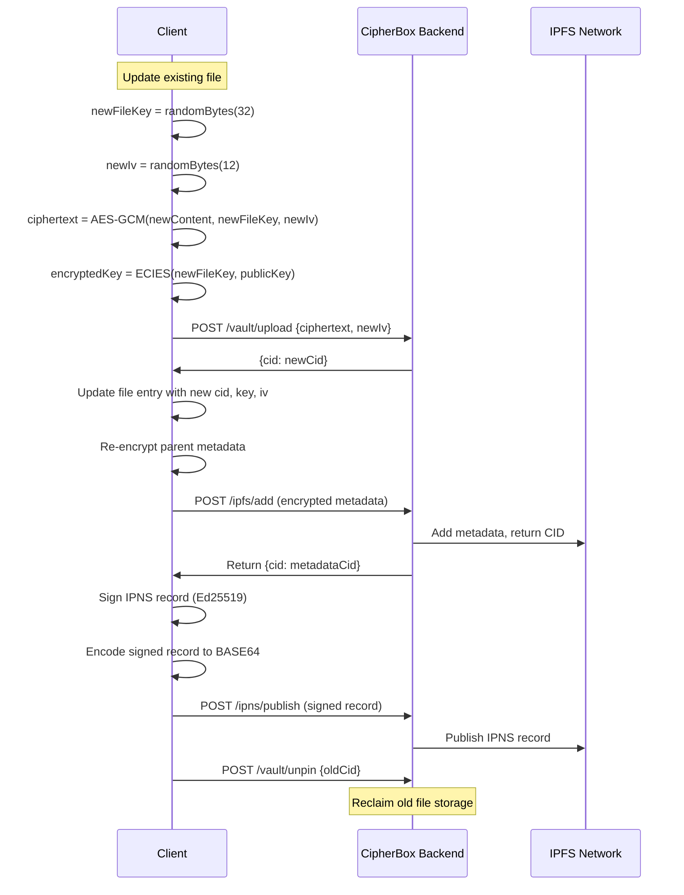
```mermaid
sequenceDiagram
    participant C as Client
    participant B as CipherBox Backend
    participant IPFS as IPFS Network
    
    Note over C: Update existing file
    
    C->>C: newFileKey = randomBytes(32)
    C->>C: newIv = randomBytes(12)
    C->>C: ciphertext = AES-GCM(newContent, newFileKey, newIv)
    C->>C: encryptedKey = ECIES(newFileKey, publicKey)
    
    C->>B: POST /vault/upload {ciphertext, newIv}
    B->>C: {cid: newCid}
    
    C->>C: Update file entry with new cid, key, iv
    C->>C: Re-encrypt parent metadata
    C->>B: POST /ipfs/add (encrypted metadata)
    B->>IPFS: Add metadata, return CID
    B->>C: Return {cid: metadataCid}
    C->>C: Sign IPNS record (Ed25519)
    C->>C: Encode signed record to BASE64
    C->>B: POST /ipns/publish (signed record)
    B->>IPFS: Publish IPNS record
    
    C->>B: POST /vault/unpin {oldCid}
    Note over B: Reclaim old file storage
```

---

## 7. Test Vectors

### 7.1 Key Derivation Consistency

**Scenario:** Verify same keypair across auth methods

```
Test: User signs up with Google, later logs in with linked email

Signup with Google:
  Web3Auth group: "cipherbox-aggregate"
  Result: publicKey = 0x04abc123...

Login with email (linked):
  Web3Auth group: "cipherbox-aggregate" (same)
  Result: publicKey = 0x04abc123... (same!)

Verification:
  ✓ Both auth methods derive identical keypair
  ✓ Both can decrypt same vault
```

### 7.2 SIWE Authentication

**Scenario:** Verify SIWE signature flow

```
Input:
  privateKey = 0x1234...
  nonce = "abc123xyz789"
  timestamp = 1705298400

Message:
  {
    "domain": "cipherbox.io",
    "publicKey": "0x04abc123...",
    "nonce": "abc123xyz789",
    "timestamp": 1705298400,
    "statement": "Sign in to CipherBox"
  }

Process:
  messageHash = keccak256(JSON.stringify(message))
  signature = ECDSA_sign(messageHash, privateKey)

Verification:
  recoveredKey = ecrecover(messageHash, signature)
  ✓ recoveredKey == publicKey
```

### 7.3 Token Refresh

**Scenario:** Verify token refresh and rotation

```
T0: Login
  accessToken expires: T0 + 15min
  refreshToken expires: T0 + 7days
  refreshToken hash stored in DB

T+14min: API call succeeds (accessToken valid)

T+16min: API call fails (accessToken expired)
  Client calls POST /auth/refresh

  Backend:
    1. Verify old refreshToken hash exists
    2. Revoke old refreshToken (set revoked_at)
    3. Generate new refreshToken, store hash
    4. Generate new accessToken

  Result:
    ✓ New accessToken (expires T+16min + 15min)
    ✓ New refreshToken (expires T+16min + 7days)
    ✓ Old refreshToken no longer valid
```

### 7.4 File Encryption Round-Trip

**Scenario:** Verify file encryption/decryption integrity

```
Input:
  plaintext = "Hello, CipherBox!" (UTF-8 bytes)
  fileKey = randomBytes(32)
  iv = randomBytes(12)

Encryption:
  ciphertext = AES-256-GCM(plaintext, fileKey, iv)
  Output: ciphertext (17 bytes) + authTag (16 bytes)

Decryption:
  result = AES-256-GCM_Decrypt(ciphertext, fileKey, iv, authTag)
  
Verification:
  ✓ result == plaintext
  ✓ Modifying ciphertext causes auth failure
  ✓ Wrong key causes decryption failure
```

### 7.5 ECIES Key Wrapping

**Scenario:** Verify ECIES encryption/decryption

```
Input:
  fileKey = randomBytes(32) // The secret to wrap
  publicKey = 0x04abc123...
  privateKey = 0x1234...

Encryption:
  encryptedKey = ECIES_Encrypt(fileKey, publicKey)
  Output: ephemeralPubkey || nonce || ciphertext || authTag

Decryption:
  result = ECIES_Decrypt(encryptedKey, privateKey)

Verification:
  ✓ result == fileKey
  ✓ Different privateKey causes failure
  ✓ Same publicKey/privateKey pair always works
```

---

## 8. Console PoC Harness Flow

The console PoC is a single-user, online test harness that executes a full filesystem flow per run and measures IPNS propagation delays. It does not use Web3Auth or the backend.

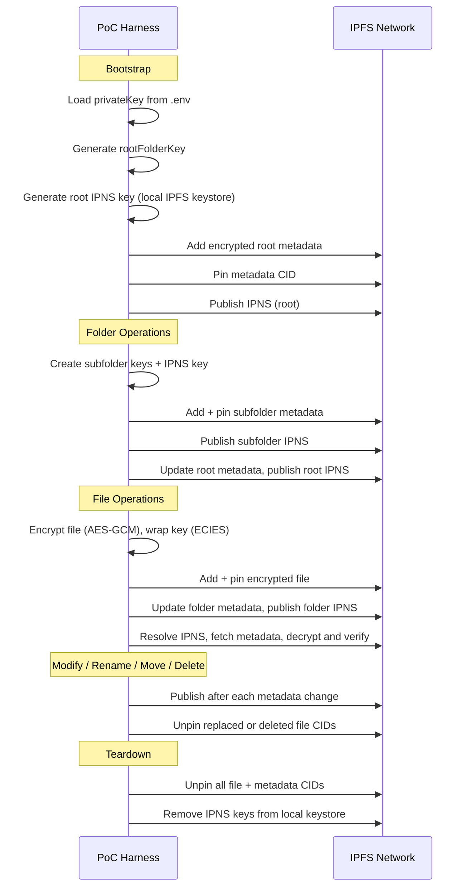
```mermaid
sequenceDiagram
    participant H as PoC Harness
    participant IPFS as IPFS Network

    Note over H: Bootstrap
    H->>H: Load privateKey from .env
    H->>H: Generate rootFolderKey
    H->>H: Generate root IPNS key (local IPFS keystore)
    H->>IPFS: Add encrypted root metadata
    H->>IPFS: Pin metadata CID
    H->>IPFS: Publish IPNS (root)

    Note over H: Folder Operations
    H->>H: Create subfolder keys + IPNS key
    H->>IPFS: Add + pin subfolder metadata
    H->>IPFS: Publish subfolder IPNS
    H->>IPFS: Update root metadata, publish root IPNS

    Note over H: File Operations
    H->>H: Encrypt file (AES-GCM), wrap key (ECIES)
    H->>IPFS: Add + pin encrypted file
    H->>IPFS: Update folder metadata, publish folder IPNS
    H->>IPFS: Resolve IPNS, fetch metadata, decrypt and verify

    Note over H: Modify / Rename / Move / Delete
    H->>IPFS: Publish after each metadata change
    H->>IPFS: Unpin replaced or deleted file CIDs

    Note over H: Teardown
    H->>IPFS: Unpin all file + metadata CIDs
    H->>IPFS: Remove IPNS keys from local keystore
```

**Verification checkpoints:**
- IPNS resolves to expected metadata CID after each publish (poll-until-resolved)
- Metadata decrypts correctly with expected entries
- File decrypts correctly after upload, update, rename, move
- All created CIDs are unpinned during teardown
```

---

## 9. Encryption Mode Selection (v1.1 Roadmap)

### 9.1 Mode Selection Logic (Future)

In v1.1, CipherBox will support automatic encryption mode selection based on MIME type:

```typescript
function selectEncryptionMode(file: File): "GCM" | "CTR" {
  const streamingTypes = [
    "video/mp4", "video/webm", "video/quicktime",
    "audio/mpeg", "audio/mp4", "audio/webm", "audio/aac"
  ];

  if (streamingTypes.includes(file.type)) {
    return "CTR";  // Enable streaming for media files
  }

  return "GCM";  // Default: authenticated encryption
}
```

### 9.2 Upload Flow with Mode Selection (v1.1)

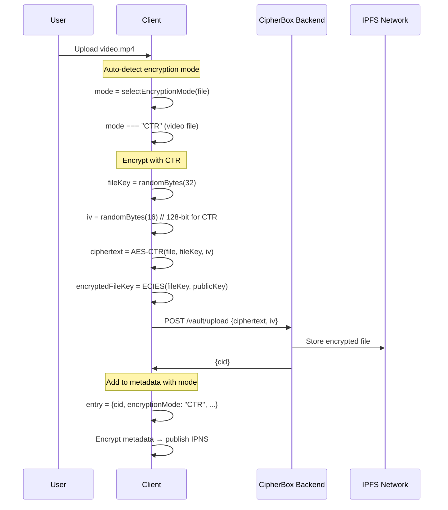
```mermaid
sequenceDiagram
    participant U as User
    participant C as Client
    participant B as CipherBox Backend
    participant IPFS as IPFS Network

    U->>C: Upload video.mp4

    Note over C: Auto-detect encryption mode
    C->>C: mode = selectEncryptionMode(file)
    C->>C: mode === "CTR" (video file)

    Note over C: Encrypt with CTR
    C->>C: fileKey = randomBytes(32)
    C->>C: iv = randomBytes(16)  // 128-bit for CTR
    C->>C: ciphertext = AES-CTR(file, fileKey, iv)
    C->>C: encryptedFileKey = ECIES(fileKey, publicKey)

    C->>B: POST /vault/upload {ciphertext, iv}
    B->>IPFS: Store encrypted file
    B->>C: {cid}

    Note over C: Add to metadata with mode
    C->>C: entry = {cid, encryptionMode: "CTR", ...}
    C->>C: Encrypt metadata → publish IPNS
```

### 9.3 Download Flow with Mode-Aware Decryption (v1.1)

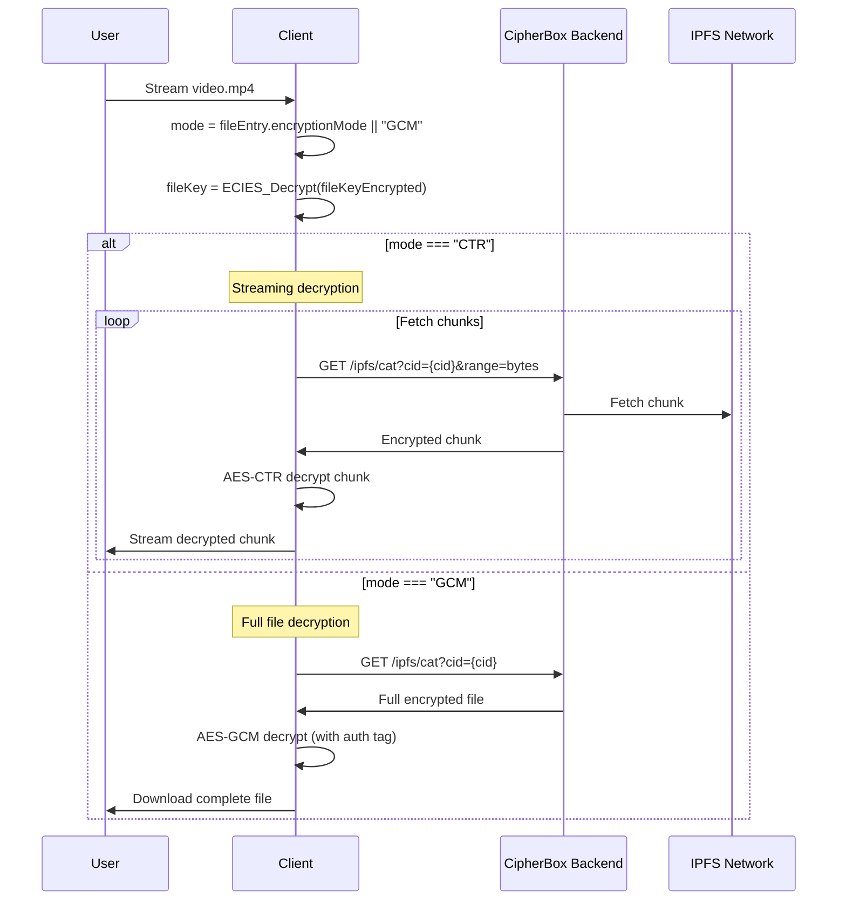
```mermaid
sequenceDiagram
    participant U as User
    participant C as Client
    participant B as CipherBox Backend
    participant IPFS as IPFS Network

    U->>C: Stream video.mp4

    C->>C: mode = fileEntry.encryptionMode || "GCM"
    C->>C: fileKey = ECIES_Decrypt(fileKeyEncrypted)

    alt mode === "CTR"
        Note over C: Streaming decryption
        loop Fetch chunks
            C->>B: GET /ipfs/cat?cid={cid}&range=bytes
            B->>IPFS: Fetch chunk
            B->>C: Encrypted chunk
            C->>C: AES-CTR decrypt chunk
            C->>U: Stream decrypted chunk
        end
    else mode === "GCM"
        Note over C: Full file decryption
        C->>B: GET /ipfs/cat?cid={cid}
        B->>C: Full encrypted file
        C->>C: AES-GCM decrypt (with auth tag)
        C->>U: Download complete file
    end
```

### 9.4 Security Implications

**CTR Mode Considerations:**
- No per-file authentication tag (unlike GCM)
- Integrity provided by IPNS Ed25519 signature + IPFS CID hash
- Tampering with encrypted content changes CID → IPNS signature verification fails
- Metadata-level authentication provides integrity protection

**v1.0 Backward Compatibility:**
- Missing `encryptionMode` field → defaults to "GCM"
- All v1.0 files work unchanged in v1.1
- No data migration required

---

## Related Documents

- [PRD.md](./PRD.md) - Product requirements and user journeys
- [TECHNICAL_ARCHITECTURE.md](./TECHNICAL_ARCHITECTURE.md) - System design and encryption
- [API_SPECIFICATION.md](./API_SPECIFICATION.md) - Backend endpoints and database schema
- [CLIENT_SPECIFICATION.md](./CLIENT_SPECIFICATION.md) - Web UI and desktop app specifications

---

**End of Data Flows**
